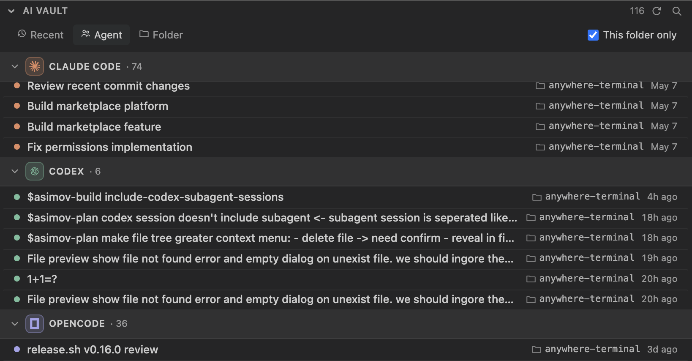
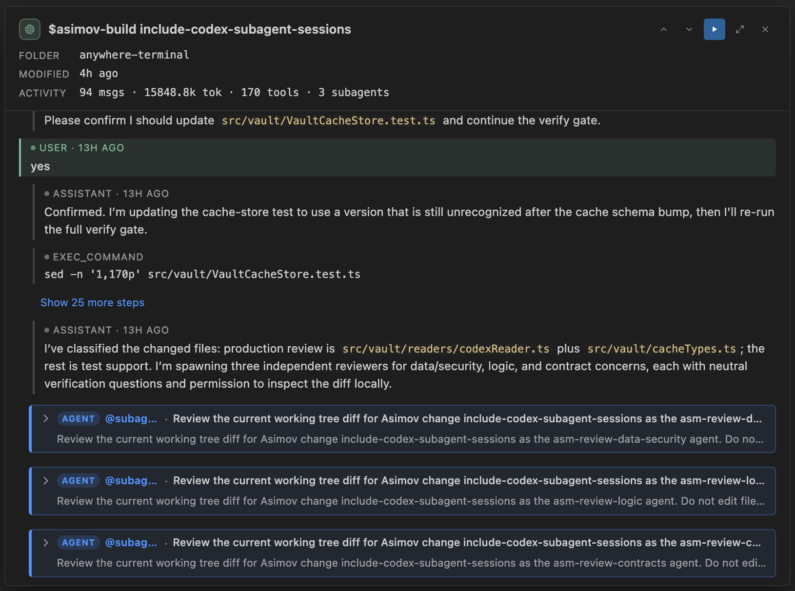

# AnyWhere Terminal

**A real terminal you can put anywhere in VS Code or Cursor — and a home base for your AI coding agents.**

Sidebar, secondary sidebar, bottom panel, or an editor tab. Split it, tab it, theme it. Then resume any **Claude Code · Codex · OpenCode** session from one panel, preview file paths straight from agent output, and keep your shell alive across reloads.


## Install

**VS Code** — search `AnyWhere Terminal` in Extensions, or:

```
ext install huybuidac.anywhere-terminal
```

**Cursor, Windsurf, Antigravity, VSCodium & other VS Code-compatible editors** — search `AnyWhere Terminal` (published to [Open VSX](https://open-vsx.org/extension/huybuidac/anywhere-terminal)).

## Quickstart

1. Click the **AnyWhere Terminal** icon in the Activity Bar — a session starts automatically.
2. Drag the view to **any** sidebar, panel, or editor group.
3. Use the title bar to add tabs or split panes. Right-click for context actions.
4. Open the **AI Vault** from the panel header (or `AnyWhere Terminal: Open AI Vault`) to browse and resume your AI-CLI sessions.

## At a glance

- 🧭 **Put the terminal anywhere** — sidebar, secondary sidebar, bottom panel, or editor tab
- 🤖 **AI Coding Vault** — resume or fork Claude Code / Codex / OpenCode sessions, with rich session previews
- 🔗 **AI-CLI-aware** — clickable paths, file hover previews, and pasted-image previews in agent output
- 🪟 **Tabs + recursive split panes** with drag-to-resize
- ♻️ **Survives reloads & restarts** — scrollback, names, cwd, and layout restore
- 📤 **Export** any command or full scrollback to a file
- 🎨 **Theme-aware, WebGL-rendered**, with an embedded file tree

---

## 🤖 AI Coding Vault

Every Claude Code, Codex, and OpenCode session you've run lives in a local store somewhere on disk — easy to lose track of across tools and folders. **AI Vault surfaces them all in one panel and lets you resume or fork any of them in a fresh terminal.**



- **Resume or fork** — pick up a past session in a new terminal, or branch a fresh thread from it (fork offered where the tool supports it, e.g. OpenCode ≥ 1.1.54).
- **Group your way** — **Recent**, **Agent**, or **Folder** grouping (persisted), with real Claude / Codex / OpenCode brand icons tinted by a per-agent accent.
- **Find it fast** — client-side search plus a **"This folder only"** filter scoped to the focused terminal's working directory.
- **Right-click for more** — Resume in New Tab, Open, Reveal in Finder/Explorer, Copy File Path or Resume Command, Open Working Directory.
- **Cross-platform** — store locations resolve per-OS (honoring `CLAUDE_CONFIG_DIR`, `CODEX_HOME` / `CODEX_SQLITE_HOME`, `XDG_DATA_HOME`); falls back to a built-in SQLite engine when the `sqlite3` CLI is missing (typically Windows). A missing store degrades to an empty list, never an error.

> **Privacy:** the panel reads from each tool's own store and refreshes from that source of truth on every open. For an instant open it keeps a small, **owner-only** metadata cache (bounded session titles + working directories) under VS Code's storage — non-authoritative, never the source of truth. Full session content is read on demand, and **nothing is ever sent off your machine.**

### Session preview

Activate any row to open a movable, content-rich floating preview — without leaving your terminal.



- **The whole story** — first prompt, a recent-activity timeline of tool and sub-agent steps, the latest assistant message, and activity stats (messages · tokens · tools · sub-agents).
- **Nested sub-agents** — spawned sub-agents render as highlighted, accent-bordered blocks with an `agent` badge, including Codex sub-agent threads nested under their parent.
- **Questions & answers** — when a session uses the ask-the-user tool (Claude Code's `AskUserQuestion`, OpenCode's `question`, Codex's `request_user_input`), the preview shows the question, your choice, and a click-to-expand list of every option.
- **Stays put** — remembers its size, position, and maximized state across reloads and restarts; drag the header to move it; a transient ↑ / ↓ control appears while scrolling.

## 🔗 Made for AI coding CLIs

Running an agent in the terminal floods it with file paths, diffs, and image attachments. AnyWhere Terminal makes that output **navigable**.

- **Clickable file paths** — paths in terminal output are underlined and open in the editor on click, jumping to the parsed line/column. Understands `src/foo.ts:42:7`, line ranges, Python tracebacks, Windows paths, `file://` URIs, and Claude/Codex CLI line-wrapping (`Read(/abs/path · lines 180-299)`).
- **Hover to preview** — hover any path for a syntax-highlighted (Shiki) preview with line numbers and markdown rendering; the target line scrolls into view. A trust-policy gate keeps dotfiles and sensitive folders from auto-previewing — press `Cmd`/`Ctrl` to override for one file.
- **Pasted-image previews** — paste an image into Claude Code / Codex / OpenCode and the CLI shows a `[Image #N]` placeholder; hover it to see the image you actually attached. Captured locally at paste time — nothing is sent anywhere.

## 🪟 Put it anywhere

The built-in terminal is awkward to reposition and can't live in the sidebar. AnyWhere Terminal lets you put a full terminal **anywhere** — without losing PTY semantics, WebGL rendering, theming, or clickable links.

- **Place it anywhere** — Primary Sidebar, Secondary Sidebar, Bottom Panel, or Editor Tab; each location remembers its own state.
- **Tabs + split panes** — horizontal/vertical splits with drag-to-resize, recursive.
- **Real terminal** — `node-pty` backed, full shell support, adaptive flow control.
- **GPU rendering** — WebGL, smooth on Retina.
- **Theme aware** — follows your VS Code theme (dark / light / high contrast).
- **Smart clipboard** — `Cmd+C` / `Cmd+V`, selection-aware, with `Ctrl+C` fallback.
- **Clickable URLs** — `Cmd+Click` with confirmation.
- **Embedded file tree** — browse the workspace alongside the terminal, with VS Code-style git decorations, live filesystem sync, in-panel search, and drag-a-row-into-a-pane to insert a path. Right-click a row for Reveal in Finder, Copy Path, Copy Relative Path, or Delete.

## Shortcuts

| Shortcut | Action |
|----------|--------|
| `Cmd+C` / `Cmd+V` | Copy / paste |
| `Cmd+K` | Clear terminal |
| `Cmd+Backspace` | Kill input line |
| `Shift+Enter` | Insert newline |
| `F2` | Rename the focused tab |

> Replace `Cmd` with `Ctrl` on non-macOS (Windows/Linux support in progress).

Run `Cmd+Shift+P` → `AnyWhere Terminal:` for the full command list.

## Settings

Key settings under `anywhereTerminal.*` (see the Settings UI for the full list):

| Setting | Default | Description |
|---------|---------|-------------|
| `shell.macOS` | `""` | Custom shell path on macOS. Empty = auto-detect. |
| `shell.linux` | `""` | Custom shell path on Linux. Empty = auto-detect. |
| `shell.windows` | `""` | Custom shell path on Windows. Empty = auto-detect. |
| `shell.args` | `[]` | Custom shell args. Empty = sensible defaults. |
| `scrollback` | `10000` | Scrollback buffer lines. |
| `fontSize` | `0` | `0` = inherit from VS Code. |
| `fontFamily` | `""` | Empty = inherit from VS Code. |
| `cursorBlink` | `true` | Cursor blink. |
| `defaultCwd` | `""` | Empty = workspace root or `$HOME`. |
| `sessionRestore.enabled` | `true` | Restore terminal scrollback and metadata across VS Code restarts. |
| `hoverPreview.delay` | `300` | Debounce (ms) before the file hover preview fetches, range 100–2000. |
| `hoverPreview.blockSensitive` | `true` | Block auto-preview for dotfiles and sensitive folders (`Cmd`/`Ctrl` overrides). |
| `fileTree.autoReveal` | `true` | Reveal the active editor file in the file tree (`"focusNoScroll"` to skip scrolling). |

> **Shell auto-detect** (empty `shell.<platform>`): uses VS Code's resolved default shell (`vscode.env.shell`, which honors `terminal.integrated.defaultProfile` and the remote host), then falls back per platform — macOS `$SHELL → /bin/zsh → /bin/bash → /bin/sh`, Linux `$SHELL → /bin/bash → /bin/sh`, Windows `%ComSpec% → cmd.exe`.
>
> **Migrating from a single `shell.macOS`:** the shell setting is now per-platform. If you previously set `shell.macOS` on Linux or Windows as a workaround, move that value to `shell.linux` / `shell.windows` — the macOS key now applies only on macOS.

## Session restore

Terminals attempt to survive two distinct interruptions:

- **Window reload (`Cmd+R` / `workbench.action.reloadWindow`)** — every terminal location keeps its PTY alive across the reload. Editor-tab terminals use a 5 s grace window before tearing down; if VS Code revives the panel within that window (the normal case), the shell continues without interruption — including long-running processes like `npm run dev`.
- **Full restart (quit and relaunch VS Code, or open a fresh workspace)** — the shell process itself does **not** survive (a fresh PTY is spawned), but the scrollback, custom tab name, view location (sidebar / panel / editor), and last known `cwd` are restored. A dim divider line marks the boundary between the restored buffer and the new shell prompt: `─── restored — last update at HH:MM ───`. If the prior shell had exited, the divider includes the exit code and the restored tab is read-only.

Persistence is workspace-scoped (when a workspace folder is open): snapshots from workspace A are not surfaced in workspace B. Storage is capped at 20 snapshots per workspace, 1 MB per snapshot, and 7 days of age — whichever comes first. Disable the entire pipeline via `anywhereTerminal.sessionRestore.enabled` if you don't want any state written to disk; toggling the setting off also purges existing snapshots. When no workspace folder is open, persistence is disabled for that window (the no-folder global directory could otherwise leak snapshots between unrelated no-folder windows).

> **What's persisted**: the serialized xterm scrollback buffer is written verbatim to disk. **Anything echoed or displayed in the terminal — passwords typed at a prompt, `cat`'d `.env` files, `aws configure` output, API tokens pasted to verify, kubeconfigs printed via `kubectl config view`, etc. — is stored in plaintext** under VS Code's per-extension storage directory until evicted by the caps above. The clear-screen command (`Cmd+K` / right-click → Clear) now also clears the persisted buffer, so use it as a privacy boundary before screen-share or hand-off. If your shell often surfaces secrets and you don't want any of them on disk, set `anywhereTerminal.sessionRestore.enabled` to `false`.

> Process revive (the actual shell process surviving a full restart) is out of scope for this release. A future opt-in path may integrate `tmux` / `screen` / `zellij` for users who need that.

## Export terminal session

Three Command Palette entries write the active terminal's content to a file:

| Command | What it writes |
|---|---|
| **AnyWhere Terminal: Export Buffer to File…** | Full scrollback of the focused terminal. Always available regardless of shell integration. |
| **AnyWhere Terminal: Export Last Command Output…** | The most-recently-completed command (`$ <command>` + exit code + cwd + output). Requires shell integration. |
| **AnyWhere Terminal: Export Command…** | Pick a tracked command from a quickpick (most-recent-first), then save. Requires shell integration. |

The save dialog offers two formats:

- **Text (ANSI stripped)** (default) — readable in any editor; ANSI escape codes removed via `strip-ansi`.
- **Raw (ANSI preserved)** — keeps color/cursor escapes so the file replays correctly in `cat` / `less -R`.

> **Exports include the literal command line, current working directory, exit code, and raw output of the terminal — review files before sharing.** Anything visible on screen ends up in the export, including credentials echoed at a prompt or secrets pasted into the shell.

### Shell integration

Per-command export ("Export Last Command Output" and "Export Command") relies on the same **OSC 633** shell-integration sequences that VS Code's built-in terminal uses. AnyWhere Terminal auto-injects VS Code's MIT-licensed scripts at PTY spawn for these shells:

| Shell | macOS | Linux | Windows |
|---|---|---|---|
| bash | ✓ | ✓ | (Git Bash supported through the same injection) |
| zsh | ✓ | ✓ | — |
| fish | ✓ | ✓ | — |
| pwsh / pwsh.exe | ✓ | ✓ | ✓ |
| sh / dash / cmd / nushell / custom | not supported — export buffer still works | | |

If you launch the shell with `bash --noprofile --norc` or `pwsh -NoProfile`, the injection is skipped — the per-command commands then surface an info toast pointing here, and you can still use "Export Buffer to File…".

**Privacy**: the per-session UUID nonce that the parser uses to validate command-line metadata is set as the `VSCODE_NONCE` environment variable on the spawned shell only.

After a window reload, tracked commands reset to empty — the scrollback is restored from snapshot but the command list is not persisted. You'll see the same "no tracked commands yet" toast as if shell integration were off; just run one command and the list rebuilds.

## Requirements

- VS Code 1.105+ or Cursor 3.2.21+
- macOS, Linux, or Windows

## Contributing

```bash
pnpm install
pnpm run watch        # rebuild on change
pnpm run test:unit    # unit tests
```

Press `F5` in VS Code to launch an Extension Development Host. Issues and PRs welcome at <https://github.com/huybuidac/anywhere-terminal/issues>.

Release process: see [`docs/RELEASING.md`](docs/RELEASING.md).

## License

[MIT](LICENSE) — third-party notices in [`THIRD_PARTY_NOTICES.md`](THIRD_PARTY_NOTICES.md).
