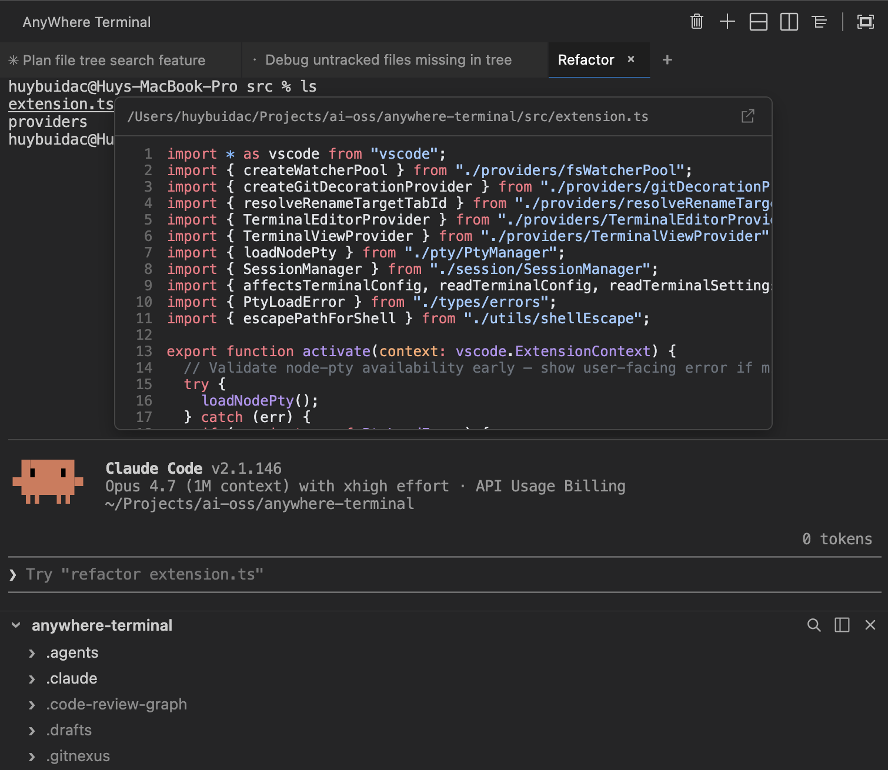

# AnyWhere Terminal

**Put your terminal anywhere in VS Code or Cursor.** Sidebar, secondary sidebar, bottom panel, or as an editor tab. Split it, tab it, theme it.




## Install

**VS Code** — search `AnyWhere Terminal` in Extensions, or:

```
ext install huybuidac.anywhere-terminal
```

**Cursor** — search `AnyWhere Terminal` (Open VSX).

## Quickstart

1. Click the **AnyWhere Terminal** icon in the Activity Bar — a session starts automatically.
2. Drag the view to **any** sidebar, panel, or editor group.
3. Use the title bar to add tabs or split panes. Right-click for context actions.

## Why

VS Code's built-in terminal is locked to the bottom. AnyWhere Terminal lets you put it anywhere — without losing PTY semantics, WebGL rendering, theming, or clickable links.

## Features

- **Place it anywhere** — Primary Sidebar, Secondary Sidebar, Bottom Panel, or Editor Tab
- **Tabs + split panes** — horizontal/vertical splits with drag-to-resize, recursive
- **Real terminal** — node-pty backed, full shell support, adaptive flow control
- **GPU rendering** — WebGL, smooth on Retina
- **Theme aware** — follows your VS Code theme (dark / light / high contrast)
- **Smart clipboard** — `Cmd+C` / `Cmd+V`, selection-aware, `Ctrl+C` fallback
- **Clickable URLs** — `Cmd+Click` with confirmation
- **Drag & drop paths** — drag from Explorer to insert absolute path

## Shortcuts

| Shortcut | Action |
|----------|--------|
| `Cmd+\` | Split vertical |
| `Cmd+Shift+\` | Split horizontal |
| `Cmd+C` / `Cmd+V` | Copy / paste |
| `Cmd+K` | Clear terminal |
| `Cmd+Backspace` | Kill input line |
| `Shift+Enter` | Insert newline |

> Replace `Cmd` with `Ctrl` on non-macOS (Windows/Linux support in progress).

Run `Cmd+Shift+P` → `AnyWhere Terminal:` for the full command list.

## Settings

All under `anywhereTerminal.*`:

| Setting | Default | Description |
|---------|---------|-------------|
| `shell.macOS` | `""` | Custom shell path. Empty = auto-detect. |
| `shell.args` | `[]` | Custom shell args. Empty = sensible defaults. |
| `scrollback` | `10000` | Scrollback buffer lines. |
| `fontSize` | `0` | `0` = inherit from VS Code. |
| `fontFamily` | `""` | Empty = inherit from VS Code. |
| `cursorBlink` | `true` | Cursor blink. |
| `defaultCwd` | `""` | Empty = workspace root or `$HOME`. |
| `sessionRestore.enabled` | `true` | Restore terminal scrollback and metadata across VS Code restarts. |

## Session restore

Terminals attempt to survive two distinct interruptions:

- **Window reload (`Cmd+R` / `workbench.action.reloadWindow`)** — every terminal location keeps its PTY alive across the reload. Editor-tab terminals use a 5 s grace window before tearing down; if VS Code revives the panel within that window (the normal case), the shell continues without interruption — including long-running processes like `npm run dev`.
- **Full restart (quit and relaunch VS Code, or open a fresh workspace)** — the shell process itself does **not** survive (a fresh PTY is spawned), but the scrollback, custom tab name, view location (sidebar / panel / editor), and last known `cwd` are restored. A dim divider line marks the boundary between the restored buffer and the new shell prompt: `─── restored — last update at HH:MM ───`. If the prior shell had exited, the divider includes the exit code and the restored tab is read-only.

Persistence is workspace-scoped (when a workspace folder is open): snapshots from workspace A are not surfaced in workspace B. Storage is capped at 20 snapshots per workspace, 1 MB per snapshot, and 7 days of age — whichever comes first. Disable the entire pipeline via `anywhereTerminal.sessionRestore.enabled` if you don't want any state written to disk; toggling the setting off also purges existing snapshots. When no workspace folder is open, persistence is disabled for that window (the no-folder global directory could otherwise leak snapshots between unrelated no-folder windows).

> **What's persisted**: the serialized xterm scrollback buffer is written verbatim to disk. **Anything echoed or displayed in the terminal — passwords typed at a prompt, `cat`'d `.env` files, `aws configure` output, API tokens pasted to verify, kubeconfigs printed via `kubectl config view`, etc. — is stored in plaintext** under VS Code's per-extension storage directory until evicted by the caps above. The clear-screen command (`Cmd+K` / right-click → Clear) now also clears the persisted buffer, so use it as a privacy boundary before screen-share or hand-off. If your shell often surfaces secrets and you don't want any of them on disk, set `anywhereTerminal.sessionRestore.enabled` to `false`.

> Process revive (the actual shell process surviving a full restart) is out of scope for this release. A future opt-in path may integrate `tmux` / `screen` / `zellij` for users who need that.

## Requirements

- VS Code 1.105+ or Cursor 3.2.21+
- macOS (Windows/Linux on the roadmap)

## Contributing

```bash
pnpm install
pnpm run watch        # rebuild on change
pnpm run test:unit    # unit tests
```

Press `F5` in VS Code to launch an Extension Development Host. Issues and PRs welcome at <https://github.com/huybuidac/anywhere-terminal/issues>.

Release process: see [`docs/RELEASING.md`](docs/RELEASING.md).

## License

[MIT](LICENSE) — third-party notices in [`THIRD_PARTY_NOTICES.md`](THIRD_PARTY_NOTICES.md).
