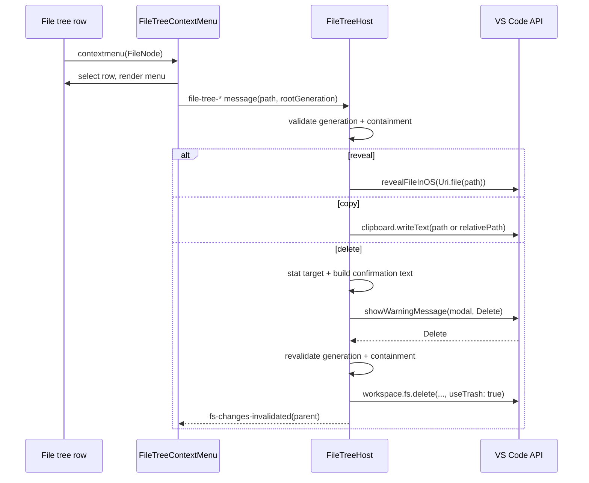

# Design: enhance-file-tree-actions

## Decisions

### D1: The context menu is a file-tree-specific webview menu

Add a new file-tree context-menu helper modeled after the existing vault context menu and file-tree position menu patterns. It renders in the webview, owns ARIA/menu close behavior, and posts action messages to the host.

This avoids native VS Code menu contribution plumbing, keeps the UI colocated with file-tree row rendering, and preserves the existing webview-only panel surface. Rejected alternative: register VS Code `menus` contributions, because webview DOM rows do not naturally participate in VS Code's native Explorer resource context.

### D2: Row context-menu capture is added at the renderer boundary

Extend `ReadOnlyFileRenderer` with an optional `onContextMenu(node, event, rowElement)` callback and keep `Tree<T>` unchanged. The renderer already binds row DOM to `FileNode` data and can skip synthetic/search rows before forwarding the event.

This preserves `Tree<T>` as a generic virtualized widget with its existing selection, activation, ARIA, and keyboard contracts. Rejected alternative: add context-menu APIs to `Tree<T>`, which would make a generic widget aware of file-tree-specific UI needs.

### D3: All path actions execute on the extension host

The webview posts typed path-action messages and the host performs reveal, clipboard, relative-path calculation, and deletion. Clipboard uses `vscode.env.clipboard.writeText`; reveal uses `vscode.commands.executeCommand("revealFileInOS", vscode.Uri.file(path))`; relative path is derived from the host-owned active file-tree root; delete uses `vscode.workspace.fs.delete`.

This matches local vault context-menu precedent and VS Code Explorer behavior while avoiding browser clipboard permission gaps. Rejected alternative: use `navigator.clipboard` for copy actions, because it is less reliable in extension webviews.

### D4: Delete supports files and folders but always confirms and moves to trash

The approved scope includes folder actions. The host stats the target, shows a modal warning with `Delete`, includes the basename plus absolute path in the prompt/detail, and deletes with `useTrash: true`; `recursive` is true only for directory targets. The host re-validates rootGeneration and containment after the modal resolves, immediately before delete.

This gives VS Code-like folder support while avoiding a permanent-delete path in v1. Rejected alternative: add `Delete Permanently` now, because it increases data-loss risk and requires extra confirmation/fallback rules beyond the requested menu.

### D5: The active file-tree root is host-owned

Add a per-webview `activeFileTreeRoot: string | null` to `FileTreeHost`. It initializes from the first VS Code workspace root, resets on workspace-folder change, and updates when the host-owned Open Folder dialog resolves before posting `reveal-in-file-tree` with `source: "openFolder"`. The webview never sends this root or a relative-path base.

This makes out-of-workspace Open Folder roots work without trusting a forged webview `basePath`. Rejected alternative: let each action message carry `basePath`, because that would make containment and relative-copy validation depend on untrusted webview input.

### D6: Host validates generation and containment before acting

Every action message carries `rootGeneration`; the host drops or errors stale actions. The host checks the target is equal to or inside `activeFileTreeRoot` before reveal, copy, relative-copy, or delete. Delete additionally rejects a target equal to `activeFileTreeRoot`, because the current root is displayed in the header rather than as a row in this v1.

This limits the risk of stale or forged webview messages acting on arbitrary filesystem paths. Rejected alternative: trust the row's absolute path because it came from the host earlier; root changes and re-rooted file trees make that insufficient for destructive actions.

### D7: Delete refreshes through existing watcher invalidation semantics

After successful delete, the host posts `fs-changes-invalidated` for the deleted target's parent directory with the current generation. The webview already treats that message as a cache invalidation and re-read trigger.

This avoids a bespoke "delete response" state machine and keeps tree refresh consistent with filesystem watcher changes. Rejected alternative: optimistically remove the row in the webview, because stale caches and expanded folder state are already handled through the data-source refresh path.

## Interfaces

```ts
// src/types/messages.ts — additions
interface FileTreeRevealInOsMessage {
  type: "file-tree-reveal-in-os";
  path: string;
  rootGeneration: number;
}

interface FileTreeCopyPathMessage {
  type: "file-tree-copy-path";
  path: string;
  rootGeneration: number;
}

interface FileTreeCopyRelativePathMessage {
  type: "file-tree-copy-relative-path";
  path: string;
  rootGeneration: number;
}

interface FileTreeDeleteMessage {
  type: "file-tree-delete";
  path: string;
  rootGeneration: number;
}
```

## Runtime Flow



## Risk Map

| Component | Risk | Mitigation |
|---|---|---|
| Delete action | Accidental file or folder loss | D4 requires modal confirmation with basename/path, trash delete, post-confirm revalidation, and no permanent-delete item; unit-test cancel and confirm branches. |
| Folder delete | Recursive deletion scope is too broad | D6 requires containment validation before delete; D4 sets `recursive` only after stat identifies a directory. |
| Path action IPC | Stale or forged path messages act on wrong target | D5/D6 require a host-owned active root plus root-generation and containment checks for every action. |
| File-tree row rendering | Context menu breaks virtualization or synthetic rows | D2 keeps `Tree<T>` unchanged and skips synthetic rows in renderer/panel tests. |
| Clipboard | Webview clipboard permission failures | D3 routes copy actions to host-side `vscode.env.clipboard`. |
| Tree refresh | Deleted item remains visible | D7 reuses `fs-changes-invalidated` parent invalidation after successful delete. |
