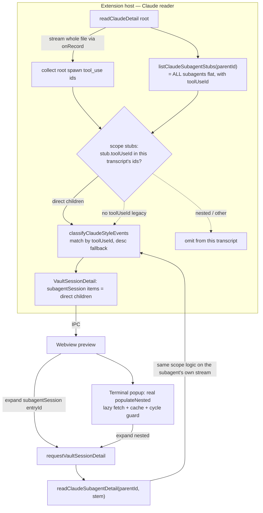

# Design: support-nested-subagent-preview

## Decisions

### D1: Parent edge = `meta.toolUseId`, not description

Each `<sessionId>/subagents/agent-<id>.meta.json` carries `toolUseId` — the `tool_use` id of
the `Agent`/`Task` call that spawned it. That `tool_use` lives in the **parent** transcript:
a root direct-child's id is in the root transcript; a nested child's id is in its parent
subagent's transcript. (Validated on a generated depth-2 session: OUTER.toolUseId 2× in root,
0× elsewhere; INNER.toolUseId 2× in OUTER, 0× in root.)

So a transcript's **direct children** = subagents whose `meta.toolUseId` ∈ that transcript's
`tool_use` ids. This is exact and unique.

Rejected: (a) current description matching — can't tell a nested child (its call isn't in the
root) from an absent one, so it silently flattens nested children to the root; (b) walking the
`parentUuid` chain — `parentUuid` links message order *within* one file, not spawn edges
*across* files, so it cannot map a child file to its parent file.

### D2: The reader scopes direct children; classify is unchanged in spirit

`listClaudeSubagentStubs(parentId)` returns the whole flat set (all subagents under
`<parentId>/subagents/`, every depth). Before classifying a transcript, the reader filters
that set to **this transcript's direct children** and passes only those to
`classifyClaudeStyleEvents`. Nested children are therefore never handed to the root read, so
they can no longer be dumped under the root by `mergeUnmatchedStubs`.

"This transcript's spawn ids" are collected from the **whole stream** (not the head+tail
bounded slice) via the same `onRecord` hook the team-context collector already uses — so a
direct child whose spawn call sits in a truncated middle is still recognized as a direct child
(and still merged at its timestamp), avoiding a truncation regression without scanning sibling
files. The collector MUST mirror classify's sidechain view: for a **root** read it counts
`Agent`/`Task` ids only from **non-`isSidechain`** records (an older mixed root file can contain
a subagent's own sidechain `Task` ids, which would otherwise surface a nested child at root);
for a **subagent** read (`includeSidechain: true`) it counts all records.

`classify` gains `toolUseId`-primary matching at the `Task`/`Agent` block (`block.id === stub.toolUseId`).
A stub that **has** a `toolUseId` binds by that id **only** — never by description (a same-description
`Task` block must not consume it). Description matching (`matchStub`) remains the fallback for
**legacy** stubs that carry **no** `toolUseId`. Because the reader (D2/D3) hands classify a stub
list already scoped to this transcript's direct children, `mergeUnmatchedStubs` SHALL merge
**every** unmatched stub it received by timestamp — including `toolUseId`-bearing ones whose
spawn block fell outside the bounded `records` — so a truncated-call direct child is still
placed (correct), and a nested child never reaches classify to be re-homed.

### D3: Recursion via `readClaudeSubagentDetail`

`readClaudeSubagentDetail(parentId, stem, …)` currently passes **no** child stubs. It SHALL
fetch the same flat set `listClaudeSubagentStubs(parentId)`, collect its own transcript's
whole-stream spawn ids, scope to its direct children, and pass them to classify (with
`includeSidechain: true`). Child entryIds stay `<parentId>:subagent:<grandchildStem>` — the
same root `parentId`, a different stem — so drilling into a grandchild dispatches back through
`readClaudeSubagentDetail` recursively. No entryId-scheme or renderer change.

### D4: Backward compatibility — legacy transcripts without `toolUseId`

A stub whose meta has no `toolUseId` (sessions written before Claude Code emitted it) keeps the
current behavior: it is included in the root's stub list, matched by description, and otherwise
merged chronologically under the root. The new scoping only *removes* a stub from a transcript
when it carries a `toolUseId` that belongs to a different transcript. Mixed sessions (some metas
with, some without) are handled per-stub.

### D5: Terminal popup nested drill-down (extend the popup's own IPC channel)

`SubagentPreviewPopup`'s `FLAT_BAG` (no-op `populateNested`) is replaced with a real bag that
lazily fetches a nested child's detail, caches it, and renders it via `renderNestedInto` —
mirroring `PreviewController.populateNested`, including the `renderingNested` self-cycle guard.
Nested-fetch state SHALL be cleared on the popup's existing idempotent `dispose()` (every
terminal teardown path), so no body-mounted node leaks (see [[project_body_overlay_disposal]]).

**IPC channel — do NOT reuse the panel's `requestVaultSessionDetail`.** That channel is handled
only by `TerminalViewProvider` (not `TerminalEditorProvider`) and `main.ts` routes
`vaultSessionDetailResponse` solely to the vault panel — so an editor-terminal popup would get
no answer and a sidebar popup would collide with the panel. Instead, **extend the popup's own
`requestSubagentPreview` round-trip** (the popup already owns it and already receives its
response on both providers) with an optional `entryId`: when present, the host resolves it via
`readClaudeDetail(entryId)` (containment-checked, no terminal/description matching) and the
response echoes the `entryId`. The popup routes an `entryId`-bearing response to `populateNested`
for that block; an `entryId`-less response stays the top-level `setContent`. This adds no new
message type, no `main.ts` reroute, and no panel collision, and covers editor + sidebar terminals
uniformly.

Rejected: a brand-new `requestSubagentNestedDetail` message pair (more surface for the same
effect); reusing `requestVaultSessionDetail` (editor-provider gap + panel-collision, per the
oracle review).

## Architecture

## Risk Map

| Component | Risk | Mitigation |
|---|---|---|
| `classifyClaudeStyleEvents` / `mergeUnmatchedStubs` | Legacy/mixed sessions regress (children vanish or re-flatten) | Per-stub `toolUseId` gate: no-`toolUseId` stubs keep description + timestamp fallback; unit test a depth-1 legacy fixture asserts identical output (task 3_1) |
| Root read | A direct child whose spawn call is truncated out of the head+tail window disappears | Collect spawn ids from the **whole stream** via `onRecord` (D2), not the bounded slice — same pattern as `teamContextCollector` |
| Recursive expand | Cycle / unbounded depth | Reuse existing `renderingNested` cycle guard (`PreviewController.ts:81`); bounded by Claude's depth-5 runtime cap and per-level `limit`/`MAX_TIMELINE_ITEMS` |
| Terminal popup | Nested fetch state leaks a body-mounted node on teardown | Clear nested cache/state in the popup's idempotent `dispose()`; [[project_body_overlay_disposal]] |
| Terminal popup IPC | Response never reaches the popup (editor-provider gap) or collides with the panel | Extend `requestSubagentPreview` (popup's own channel, handled by both providers; response already routed to the popup) with an optional `entryId`; do NOT reuse `requestVaultSessionDetail` (D5) |
| Root spawn-id scan | A mixed/older root file's sidechain `Task` ids surface a nested child at root | Collect root spawn ids from non-`isSidechain` records only (D2); task 1_3 |
| `subagentCount` | Whole-tree count shown at root inflates/desyncs | Count direct children of the rendered transcript only (D2); covered by task 3_1 |
| Reader I/O | Extra cost per preview | Scoping reuses the single stream already read; flat-stub list already read today; **no** added file opens |

## Data-Scale

- **Per-transcript direct-children set** (new derived value): growth axis = subagents spawned by
  one parent. Bound = Claude runtime depth-5 spawn cap × per-parent fan-out, then the existing
  `MAX_TIMELINE_ITEMS` timeline bound and per-level `limit`. No unbounded growth.
- **Tree traversal**: lazy — only the expanded transcript is read; the whole tree is never
  loaded eagerly. No full-recompute on a hot path.
- **`subagentCount`**: O(direct children) per read, from data already in hand.
