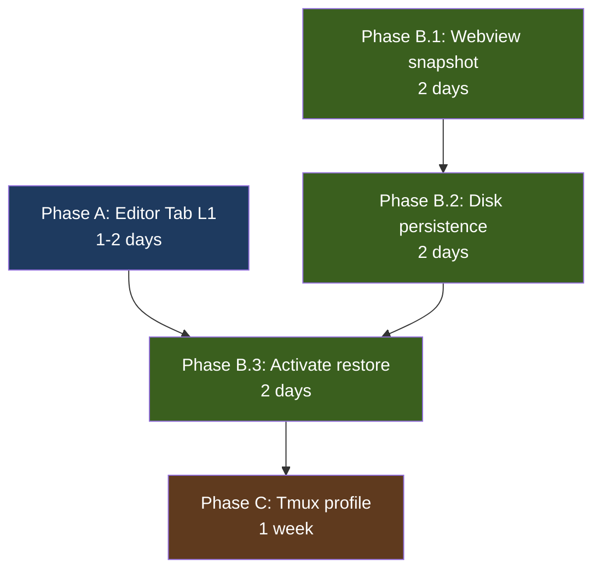

# AnyWhere Terminal — Session Restore Implementation Plan

> **Target:** AT v0.13.x — full Session/Buffer Restore feature across all 3 levels.
> **Status:** Implementation plan based on code audit of AT v0.12.2 + research May 2026.
> **Author note:** This plan is grounded in actual code reading, not guesswork. Every "current state" claim has a file:line citation.

---

## 0. Executive Summary

AT v0.12.2 **already implements ~60% of Level 1** (webview reload) — but it has a critical gap and several improvements possible.

| Level | Sidebar/Panel | Editor Tab | Full Restart |
|---|---|---|---|
| **L1: Webview reload** | ✅ Working (PTY survives) | ❌ **BROKEN** (PTY dies) | n/a |
| **L2: Buffer restore on restart** | ❌ Not implemented | ❌ Not implemented | ❌ Not implemented |
| **L3: Process revive on restart** | ❌ Not implemented (tmux) | ❌ Not implemented | ❌ Not implemented |

**Recommended sequencing:**
1. **Phase A (1-2 days):** Fix editor tab reload bug → L1 parity across all 3 locations
2. **Phase B (1 week):** Add cross-restart buffer restore → L2 for all locations
3. **Phase C (1 week, optional):** Tmux-wrapped persistent shell profile → L3 opt-in

**Total estimated effort:** 1-3 weeks depending on scope.

---

## 1. Current Code Audit

### 1.1 What works today

**Sidebar/Panel L1 (webview reload, process survives):**

The implementation is **architecturally correct**. From `TerminalViewProvider.ts:582-608`:

```typescript
if (existingTabs.length > 0) {
  // Re-creation scenario: sessions already exist for this view
  this.sessionManager.updateWebviewForView(viewId, webviewView.webview);
  
  // Send 'init' with existing tabs
  void this.safeSendWithRetry(webviewView.webview, { type: "init", tabs: existingTabs, ... });
  
  // Send 'restore' messages with scrollback for each session
  for (const tab of existingTabs) {
    const scrollbackData = this.sessionManager.getScrollbackData(tab.id);
    if (scrollbackData) {
      this.safePostMessage(webviewView.webview, {
        type: "restore", tabId: tab.id, data: scrollbackData,
      });
    }
  }
}
```

**Why this works:** 
- Sidebar/Panel use `vscode.window.registerWebviewViewProvider` with `retainContextWhenHidden: true` (`extension.ts:55, 70`)
- When VS Code reloads the webview, it calls `resolveWebviewView()` AGAIN on the same provider
- SessionManager (singleton) still has the session → swap webview ref → replay scrollback
- **The PTY process is never killed during this** — it's owned by extension host, not webview

This is essentially what VS Code core calls "process reconnection" and what tao described in the previous message as "free process revive on Cmd+R reload."

**Scrollback cache (`SessionManager.ts:735-744`):**

```typescript
private appendToScrollback(session: TerminalSession, data: string): void {
  session.scrollbackCache.push(data);
  session.scrollbackSize += data.length;
  // Evict oldest chunks until under limit (SCROLLBACK_MAX_SIZE = 512 * 1024)
  while (session.scrollbackSize > SCROLLBACK_MAX_SIZE && session.scrollbackCache.length > 0) {
    const evicted = session.scrollbackCache.shift()!;
    session.scrollbackSize -= evicted.length;
  }
}
```

Raw byte buffer (string[] of ANSI sequences), 512KB cap, FIFO eviction. **In-memory only — dies when extension host dies.**

### 1.2 The critical bug — Editor tab L1

From `TerminalEditorProvider.ts:247-257`:

```typescript
this._panel.onDidDispose(() => {
  for (const d of disposables) { d.dispose(); }
  this.cancelAllPreviewTokens();
  TerminalEditorProvider._activePanels.delete(this._panel);
  TerminalEditorProvider._instances.delete(this._panel);
  this.sessionManager.destroyAllForView(this._viewId);  // ← KILLS PTY
});
```

**Problem:** `onDidDispose` fires for BOTH:
- User closing the editor tab (correct behavior to destroy)
- Window reload (Cmd+R, install extension) — should NOT destroy

VS Code doesn't give a direct signal to distinguish these cases. So the current implementation kills the PTY in both cases. This makes editor tab terminals lose their state on every reload.

Plus, each editor panel has a unique `_viewId = 'editor-${crypto.randomUUID()}'` (`TerminalEditorProvider.ts:137`), so even if we kept the session alive, the new editor panel after reload would have a different viewId and couldn't find it.

### 1.3 Missing pieces for L2

- No `vscode.window.registerWebviewPanelSerializer` registered (`extension.ts` audit)
- No serialization of scrollback to `workspaceState` (only `tabCustomNames` is persisted)
- No serialization of session metadata (cwd, shell, custom name, layout)
- `deactivate()` is empty (`extension.ts:526`)
- Webview state via `vscode.setState()` stores ONLY split tree layout (`WebviewStateStore.ts`), NOT scrollback content

### 1.4 Dependencies status

From `package.json`:
- `@xterm/xterm: ^6.0.0` ✅
- `@xterm/addon-fit: ^0.11.0` ✅
- `@xterm/addon-web-links: ^0.12.0` ✅
- `@xterm/addon-webgl: ^0.19.0` ✅
- `@xterm/addon-serialize` ❌ **NOT INSTALLED**
- `xterm-headless` ❌ **NOT INSTALLED**

---

## 2. Architecture Decision: Raw Bytes vs SerializeAddon

AT currently uses **raw byte buffer** (Approach A). Tao đã research kỹ — đây là so sánh:

| Aspect | A: Raw bytes (current) | B: SerializeAddon + xterm-headless mirror |
|---|---|---|
| Storage size for same visual state | Larger (cursor moves, redraws kept) | Smaller (final state only) |
| CPU on output | Zero (just append) | ~5-15% (parse every byte through xterm-headless) |
| Restore time | Fast (just `xterm.write()`) | Fast (also just `write()`) |
| Bundle size impact | 0 | +~50-100KB extension host *[Recall — not benchmarked]* |
| Handles alt buffer (vim/htop) correctly | No (replays the entire vim session) | Yes (skips alt buffer per VS Code's approach) |
| Disk serialization size | Larger | Smaller |
| Implementation complexity | Trivial | Medium |

**Verified VS Code's approach** *[Verified — vscode #133516]*:

> *"Open the alt buffer (eg. run vim or tmux) and trigger process revive, the alt buffer should not be restored but whatever was in the normal buffer before opening vim should be."*

This is a known UX win that **only Approach B delivers**. Raw byte replay will faithfully redraw vim's UI state — looks broken because vim is no longer running.

**Recommendation: Hybrid**
- **L1 (webview reload):** Keep raw bytes — process is alive, will quickly produce new output. Current 512KB cap is fine.
- **L2 (cross-restart):** Add xterm-headless mirror + SerializeAddon — disk efficiency matters, alt-buffer correctness matters.
- **L3 (tmux):** N/A — tmux owns the buffer.

---

## 3. Phase A — Editor Tab L1 Parity (1-2 days)

**Goal:** Editor tab terminals survive window reload exactly like sidebar/panel do.

**Approach:** Register a `WebviewPanelSerializer` for editor terminals. Move session ownership from "per-panel" to "per-panel-identity" tracked in `workspaceState`.

### 3.1 Add panel identity persistence

Each editor panel needs a stable ID that survives reload. Currently `_viewId = 'editor-${randomUUID()}'` is fresh per construction → can't find old session.

**Change:** Generate panel ID once, persist to `workspaceState`, list of "live editor panels":

```typescript
// New key in workspaceState
const LIVE_EDITOR_PANELS_KEY = "anywhereTerminal.liveEditorPanels";
// Value shape: Array<{ panelId: string; sessionIds: string[]; createdAt: number }>
```

When a new editor panel is created via `createPanel()`, append entry to this list. When user closes the panel intentionally, remove entry.

### 3.2 Register WebviewPanelSerializer

In `extension.ts:activate()`:

```typescript
context.subscriptions.push(
  vscode.window.registerWebviewPanelSerializer(
    TerminalEditorProvider.viewType,  // "anywhereTerminal.editor"
    new TerminalPanelSerializer(context, sessionManager, ...)
  )
);
```

`TerminalPanelSerializer.deserializeWebviewPanel(panel, state)` — VS Code calls this after restart for each panel that was open. State is whatever the webview wrote via `vscode.setState()`.

We'll store the `panelId` in webview state, so on revive we can look up:
1. If extension host is alive (which it isn't after restart — but covered in Phase B)
2. After restart: no session exists, but we have persisted scrollback → spawn new shell + restore (Phase B)

**For Phase A only:** Register serializer that just recreates panel HTML and creates fresh session. This is L1 parity — no scrollback survives restart **yet**, but the serializer infrastructure is in place.

### 3.3 Distinguish reload vs close

`onDidDispose` fires for both. The trick from VS Code core: **defer destruction**.

```typescript
// In TerminalEditorProvider.setupPanel(), replace the current onDidDispose:
this._panel.onDidDispose(() => {
  for (const d of disposables) { d.dispose(); }
  this.cancelAllPreviewTokens();
  TerminalEditorProvider._activePanels.delete(this._panel);
  TerminalEditorProvider._instances.delete(this._panel);
  
  // Schedule destroy after grace period — cancelled if panel revives
  // VS Code's WebviewPanelSerializer is called within ~1-2s of reload typically
  this.sessionManager.scheduleDestroyForView(this._viewId, /*delayMs*/ 5000);
});
```

Add to `SessionManager`:

```typescript
scheduleDestroyForView(viewId: string, delayMs: number): void {
  const timer = setTimeout(() => {
    this.pendingDestroys.delete(viewId);
    this.destroyAllForView(viewId);
  }, delayMs);
  this.pendingDestroys.set(viewId, timer);
}

cancelScheduledDestroy(viewId: string): void {
  const timer = this.pendingDestroys.get(viewId);
  if (timer) {
    clearTimeout(timer);
    this.pendingDestroys.delete(viewId);
  }
}
```

When the serializer creates the new panel for the same `panelId`, it calls `cancelScheduledDestroy(viewId)` → PTY survives.

**Implementation detail:** `viewId` (the runtime ID) must be derived from `panelId` (the persisted ID). One mapping:

```typescript
// In serializer
const viewId = `editor-${state.panelId}`;
// In TerminalEditorProvider constructor — accept optional panelId param
this._viewId = `editor-${panelId ?? crypto.randomUUID()}`;
```

### 3.4 Files to change

| File | Change |
|---|---|
| `src/providers/TerminalEditorProvider.ts` | Accept optional `panelId` param in constructor; persist to webview state via `vscode.setState`; modify `onDidDispose` to schedule destroy instead of immediate |
| `src/providers/TerminalPanelSerializer.ts` (NEW) | Implements `WebviewPanelSerializer`; on `deserializeWebviewPanel`, instantiate `TerminalEditorProvider` with persisted `panelId`, cancel scheduled destroy |
| `src/session/SessionManager.ts` | Add `scheduleDestroyForView()`, `cancelScheduledDestroy()`, `pendingDestroys: Map<string, NodeJS.Timeout>` |
| `src/extension.ts` | Register serializer; on `deactivate()`, clear all pending destroy timers |
| `package.json` | Add to `activationEvents`: `"onWebviewPanel:anywhereTerminal.editor"` (so extension activates when VS Code revives a panel) |

### 3.5 Acceptance criteria

- [ ] Open editor terminal → run `npm run dev` → reload window (Cmd+R) → PTY still alive, dev server still running
- [ ] Open editor terminal → CLOSE THE TAB → after 5s, PTY destroyed (no leak)
- [ ] Open editor terminal → restart VS Code → panel reappears (empty for now — Phase B adds content restore)
- [ ] No memory leak: scheduled destroys cleared on extension deactivate
- [ ] Sidebar/Panel behavior unchanged (regression test)

### 3.6 Risks

- **Risk:** 5s grace period might be too short if VS Code is slow to revive panel (cold start). **Mitigation:** Make configurable; default 10s based on VS Code's own behavior *[Engineering reasoning — needs empirical test]*.
- **Risk:** If user closes tab then quickly reopens, the new panel is a different identity — no revive. **Mitigation:** Accept this; only window reload triggers serializer.
- **Risk:** Memory leak if pending timer not cleared on extension deactivate. **Mitigation:** SessionManager dispose clears all timers.

---

## 4. Phase B — Cross-Restart Buffer Restore (1 week)

**Goal:** Survive full VS Code restart with scrollback + cwd + custom name + layout. Process IS respawned (new shell), not the old PTY.

**Honest framing (PLAN.md §5.3 oracle revision):** *"Your scrollback survives a VS Code restart. Your running processes do not. For process revive, use the optional persistent-shell profile (Phase C)."*

### 4.1 Add dependencies

```bash
pnpm add @xterm/addon-serialize xterm-headless
```

Verify bundle impact:
- `@xterm/addon-serialize`: webview side, used to serialize WHILE buffer is in the renderer
- `xterm-headless`: extension host side, mirror PTY output to keep state when no webview is attached

Actually for L2 cross-restart, we don't need xterm-headless in extension host — we serialize from the webview before shutdown. **Simpler approach:**

**Architecture choice:** Webview-driven serialization

1. Before extension host dies (or periodically every 30s), webview calls `serializeAddon.serialize()` and sends the string to extension host
2. Extension host writes to `workspaceState` under key `anywhereTerminal.sessionSnapshots`
3. On activate, restore snapshots when creating sessions

**Why this is simpler:**
- No xterm-headless dependency in extension host (smaller bundle)
- No CPU cost of mirroring every byte
- Webview is authoritative for "what user actually saw"

**Trade-off:**
- If webview is killed without warning (crash), snapshot is stale
- Mitigation: periodic snapshots every 30s + on `onWillDispose`

### 4.2 Session metadata snapshot

Need to persist more than just scrollback:

```typescript
// New workspaceState key
const SESSION_SNAPSHOTS_KEY = "anywhereTerminal.sessionSnapshots";

interface SessionSnapshot {
  // Identity
  panelId?: string;        // for editor tabs
  viewLocation: "sidebar" | "panel" | "editor";
  terminalNumber: number;  // for auto-naming
  customName: string | null;
  
  // PTY config
  shell: string;
  shellArgs: string[];
  cwd: string;             // initial cwd from spawn
  currentCwd?: string;     // latest from OSC 7/633
  
  // Visual state
  serializedBuffer: string;  // from SerializeAddon — ANSI sequences
  cols: number;
  rows: number;
  
  // Metadata
  snapshotAt: number;  // timestamp ms
  shellExitCode?: number;  // if shell exited cleanly before snapshot
}

interface SessionSnapshotsRecord {
  version: 1;
  snapshots: Record<string, SessionSnapshot>;  // keyed by sessionId
  layouts: Record<string, SplitLayoutTree>;    // keyed by panelId/viewId
}
```

### 4.3 Webview-side: capture & send

Add to webview's terminal instance:

```typescript
// In webview/terminal/TerminalInstance.ts (or wherever xterm Terminal is created)
import { SerializeAddon } from "@xterm/addon-serialize";

const serializeAddon = new SerializeAddon();
xtermTerminal.loadAddon(serializeAddon);

// Snapshot trigger: periodic + on visibility change + on beforeunload
const SNAPSHOT_INTERVAL_MS = 30_000;
setInterval(() => sendSnapshot(), SNAPSHOT_INTERVAL_MS);

window.addEventListener("beforeunload", () => sendSnapshot(/*sync*/ true));

function sendSnapshot() {
  const serialized = serializeAddon.serialize({
    scrollback: 1000,  // configurable; matches terminal.integrated.persistentSessionScrollback default
    excludeModes: true,  // skip alt buffer state per VS Code's pattern
  });
  vscode.postMessage({
    type: "snapshot",
    tabId: terminalId,
    serializedBuffer: serialized,
    cols: xtermTerminal.cols,
    rows: xtermTerminal.rows,
  });
}
```

Add new message type to `src/types/messages.ts`:

```typescript
export interface SnapshotMessage {
  type: "snapshot";
  tabId: string;
  serializedBuffer: string;
  cols: number;
  rows: number;
}
```

### 4.4 Extension host-side: persist

Add to `SessionManager`:

```typescript
handleSnapshot(sessionId: string, payload: { serializedBuffer: string; cols: number; rows: number }): void {
  const session = this.sessions.get(sessionId);
  if (!session) return;
  
  this.pendingSnapshots.set(sessionId, {
    panelId: session.panelId,
    viewLocation: this.deriveViewLocation(session.viewId),
    terminalNumber: session.number,
    customName: session.customName,
    shell: session.spawnedShell,
    shellArgs: session.spawnedArgs,
    cwd: session.initialCwd ?? "",
    currentCwd: session.currentCwd,
    serializedBuffer: payload.serializedBuffer,
    cols: payload.cols,
    rows: payload.rows,
    snapshotAt: Date.now(),
  });
  
  // Debounced persist (avoid hammering workspaceState)
  this.schedulePersist();
}

private schedulePersist(): void {
  if (this.persistTimer) return;
  this.persistTimer = setTimeout(() => {
    this.persistTimer = undefined;
    this.flushSnapshotsToStorage();
  }, 1000);
}

private flushSnapshotsToStorage(): void {
  const record: SessionSnapshotsRecord = {
    version: 1,
    snapshots: Object.fromEntries(this.pendingSnapshots),
    layouts: this.lastKnownLayouts,
  };
  this.snapshotStorage.update(SESSION_SNAPSHOTS_KEY, record);
}
```

**Important:** Also call `flushSnapshotsToStorage()` in `dispose()` (synchronous best-effort on extension deactivate).

### 4.5 Activate-time restore

In `extension.ts:activate()`:

```typescript
const persistedSnapshots = context.workspaceState.get<SessionSnapshotsRecord>(SESSION_SNAPSHOTS_KEY);
sessionManager.hydrateFromSnapshots(persistedSnapshots);
```

In `SessionManager.hydrateFromSnapshots()`:
- Parse snapshots, store in internal map keyed by sessionId
- Don't create sessions yet — wait for the view providers to call `resolveWebviewView` / serializer

When `TerminalViewProvider.resolveWebviewView` is called on activate, it checks `sessionManager.getSnapshotsForLocation('sidebar')`. If snapshots exist:

```typescript
// In TerminalViewProvider — modified resolution
const snapshots = this.sessionManager.consumeSnapshotsForLocation(viewLocation);
if (snapshots.length > 0) {
  // Restore mode: recreate each snapshot as a fresh session, then write serialized buffer
  for (const snap of snapshots) {
    const sessionId = this.sessionManager.createSession(viewId, webview, {
      shell: snap.shell,
      shellArgs: snap.shellArgs,
      cwd: snap.currentCwd ?? snap.cwd,
      // NEW option:
      restoreBuffer: snap.serializedBuffer,
      restoreTerminalNumber: snap.terminalNumber,
      restoreCustomName: snap.customName,
    });
  }
  // Send init message with the restored tabs
  void this.safeSendWithRetry(webview, { type: "init", tabs: ..., ... });
  // For each session, send "restore" message with serialized buffer
  for (const snap of snapshots) {
    safePostMessage(webview, {
      type: "restoreFromSnapshot",
      tabId: sessionId,
      serializedBuffer: snap.serializedBuffer,
      reattachedAt: snap.snapshotAt,
    });
  }
}
```

### 4.6 Webview-side restore

Webview receives `restoreFromSnapshot` message:

```typescript
case "restoreFromSnapshot": {
  const terminal = factory.getOrCreate(msg.tabId, ...);
  // Write serialized buffer BEFORE the new PTY produces any output
  // This is best done before terminal.open() per xterm docs
  terminal.write(msg.serializedBuffer);
  // Then write the reattached marker
  const date = new Date(msg.reattachedAt).toLocaleString();
  terminal.write(`\r\n\x1b[2m─── reattached (process not revived) — last snapshot ${date} ───\x1b[0m\r\n`);
  break;
}
```

### 4.7 Editor tab integration with Phase A serializer

The serializer's `deserializeWebviewPanel(panel, state)` now does more:

```typescript
async deserializeWebviewPanel(panel: vscode.WebviewPanel, state: { panelId?: string }): Promise<void> {
  const panelId = state?.panelId ?? crypto.randomUUID();
  
  // Try to restore from persisted snapshots
  const snapshots = this.sessionManager.consumeSnapshotsForPanel(panelId);
  
  // Recreate TerminalEditorProvider with the panelId
  const provider = new TerminalEditorProvider(
    this.context.extensionUri,
    this.sessionManager,
    panel,
    this.gitDecorationProvider,
    this.watcherPool,
    /*restoreSnapshots*/ snapshots,
    /*panelId*/ panelId,
  );
}
```

### 4.8 Eviction & limits

- Snapshots older than 7 days dropped on hydrate
- Per-workspace cap: 20 snapshots max, oldest dropped first
- Per-snapshot cap: serializedBuffer ≤ 1MB (truncate scrollback if larger)
- Total `workspaceState` per workspace: cap 20MB *[Recall — VS Code workspaceState has no hard limit documented but performs poorly above ~50MB]*

### 4.9 Acceptance criteria

- [ ] Full VS Code restart → sidebar terminals come back with scrollback visible
- [ ] Full VS Code restart → panel terminals come back
- [ ] Full VS Code restart → editor tab terminals come back (panel re-appears)
- [ ] Restored terminals show `─── reattached ───` divider
- [ ] Restored terminals have correct cwd (set from `currentCwd` if available, else `cwd`)
- [ ] Custom tab names preserved
- [ ] Split layouts preserved
- [ ] Snapshots older than 7 days auto-evicted
- [ ] No `workspaceState` bloat (>20MB warning)
- [ ] Alt buffer (vim) NOT restored — only normal buffer

### 4.10 Risks

- **Risk:** SerializeAddon performance on large scrollback. *[Verified — xterm.js PR #3101]* claims *"5000 rows in 200ms on chrome"*. For 1000 lines this should be <50ms.
- **Risk:** workspaceState bloat. Mitigation: caps + eviction + warning.
- **Risk:** Race: extension deactivates before webview snapshot arrives. Mitigation: webview sends snapshot on `beforeunload` synchronously via `vscode.postMessage`; extension's `dispose()` flushes pending writes.
- **Risk:** Restored buffer doesn't match new terminal dimensions (user resized window between sessions). Mitigation: resize new xterm to match snapshot dimensions BEFORE write, then resize to actual dimensions AFTER.
- **Risk:** Shell startup output collides with restored buffer paint. Mitigation: pause output flushing until restore complete, then resume.

---

## 5. Phase C — True Process Revive via Tmux (1 week, OPT-IN)

**Goal:** TRUE process revive. `npm run watch` keeps running across full VS Code restart.

**Critical positioning:** This is **opt-in only**. Not default. Heavy honest framing.

### 5.1 Why opt-in only

| Reason | Detail |
|---|---|
| Cross-platform fragility | tmux not on Windows by default; zellij/screen alternatives have different semantics |
| Conflicts with user's existing tmux | If user already uses tmux for SSH, AT's wrap creates double-multiplexing weirdness |
| Shell integration interference | VS Code OSC 633 sequences may not pass through tmux correctly (`docs/external-research/custom-claude.md` cites this for VS Code's own pty-host issues) |
| Trust posture | "Extension wraps my shell silently" smells bad after May 2026 VS Code extension incidents |
| Performance | Tmux adds latency (PLAN.md cites ~200ms but **this is unverified** — need benchmark) |

**Verified VS Code's own approach:** *[Verified — vscode #133516]* explicitly notes that even their built-in "process revive" does NOT keep processes alive; it only restores buffer + respawns shell. True process revive **requires user opt-in to tmux wrapping** (per João Moreno blog, George Honeywood blog).

### 5.2 Implementation

Add a new terminal profile option in AT settings:

```jsonc
{
  "anywhereTerminal.persistentShell.enabled": false,  // default OFF
  "anywhereTerminal.persistentShell.multiplexer": "tmux",  // tmux | screen | zellij
  "anywhereTerminal.persistentShell.sessionNameTemplate": "at-${workspaceFolderBasename}-${terminalNumber}"
}
```

When enabled, AT modifies the spawn command:

```typescript
// In PtyManager.detectShell() or new method
function buildPersistentShellCommand(realShell: string, sessionName: string): { shell: string; args: string[] } {
  const multiplexer = readSetting("persistentShell.multiplexer");
  
  switch (multiplexer) {
    case "tmux":
      return {
        shell: "tmux",
        args: [
          "new-session",
          "-A",       // attach if exists, else create
          "-D",       // detach others first (prevent multiple AT windows fighting)
          "-s", sessionName,
          realShell,  // launches user's actual shell inside tmux
        ],
      };
    case "zellij":
      return {
        shell: "zellij",
        args: ["attach", "--create", sessionName, "options", "--default-shell", realShell],
      };
    // etc.
  }
}
```

### 5.3 Pre-flight checks on activate

```typescript
async function preflightCheckPersistentShell(): Promise<{ available: boolean; reason?: string }> {
  if (process.platform === "win32") {
    return { available: false, reason: "Persistent shell requires tmux/screen — not natively available on Windows. Try WSL." };
  }
  
  const mux = readSetting("persistentShell.multiplexer");
  try {
    await execFile(mux, ["-V"]);  // check installed
    return { available: true };
  } catch {
    return { available: false, reason: `${mux} not found. Install: brew install ${mux} (macOS) / apt install ${mux} (Linux)` };
  }
}
```

If preflight fails, show informative notification with install instructions; auto-disable the setting; fall through to regular shell.

### 5.4 Status indication

A persistent-shell session looks/behaves differently in subtle ways:
- Banner on first reattach: *"Reattached to persistent session 'at-myproject-1' — npm run dev is still running"*
- Status bar icon when in persistent mode
- Setting visible in tab tooltip

### 5.5 Acceptance criteria

- [ ] Enable persistent shell → run `npm run dev` → restart VS Code → terminal restored AND dev server still running
- [ ] Disable persistent shell → all terminals behave like Phase B (buffer restore only)
- [ ] Preflight check on Windows → setting visibly disabled with explanation
- [ ] No corruption when used WITH Phase B snapshot system (snapshots become extra safety net, not conflict)
- [ ] User's existing tmux sessions (non-AT) unaffected — AT uses its own session naming

### 5.6 Risks

- **Risk:** OSC 633 shell integration sequences may not propagate through tmux correctly. **Mitigation:** Document known limitation; provide workaround using `tmux set-option -ga update-environment`.
- **Risk:** User has tmux config that conflicts (status bar, prefix key remapping). **Mitigation:** Optional `-f /dev/null` flag to ignore user's `.tmux.conf` (with setting `persistentShell.useUserConfig: true` to opt-in).
- **Risk:** Hung tmux session accumulates over time. **Mitigation:** Add command `AnyWhere Terminal: Kill All Persistent Sessions` and document `tmux kill-server`.

---

## 6. Implementation Order & Dependencies



**Critical path:** Phase A must complete first because Phase B's editor-tab story depends on the serializer registration.

**Phase B can ship without Phase C** — most users get good value from buffer restore alone.

**Phase C can be deferred indefinitely** — only ship when there's clear user demand signal.

---

## 7. Testing Strategy

### 7.1 Unit tests

| Test | Location |
|---|---|
| `scheduleDestroyForView` cancellation logic | `SessionManager.test.ts` |
| Snapshot record schema validation (corrupt JSON, missing fields) | `SessionManager.test.ts` |
| Eviction (7-day age cutoff, 20-snapshot cap) | `SessionManager.test.ts` |
| SerializeAddon integration | `webview/terminal/*.test.ts` |
| WebviewPanelSerializer mock revive | `TerminalEditorProvider.test.ts` |

### 7.2 Integration tests

Add new test file `src/test/sessionRestore.integration.test.ts`:

| Scenario | Expected |
|---|---|
| Sidebar reload (existing test should pass) | PTY survives, scrollback replayed |
| Editor tab reload (NEW) | PTY survives, scrollback replayed |
| Editor tab user-close | After 5s grace, PTY destroyed |
| Editor tab close-then-reopen-quickly | New session created (no false revive) |
| Cross-restart sidebar | Buffer restored, new PTY spawned, divider shown |
| Cross-restart editor | Panel revived, buffer restored |
| Cross-restart with custom names | Names preserved |
| Cross-restart with splits | Layout preserved |
| Cross-restart with vim active | Alt buffer NOT restored, normal buffer restored |
| 7-day-old snapshot | Evicted, no restore |
| 21st snapshot creation | Oldest evicted |

### 7.3 Manual test matrix

| Platform | Phase A | Phase B | Phase C |
|---|---|---|---|
| macOS Intel | ✓ | ✓ | ✓ |
| macOS Apple Silicon | ✓ | ✓ | ✓ |
| Linux | (later phase) | (later phase) | (later phase) |
| Windows | (later phase) | (later phase) | n/a — Phase C unavailable |

### 7.4 Failure mode tests

- Corrupted `workspaceState`: extension activates without errors, sessions start fresh
- `workspaceState` >50MB: warning shown, auto-prune oldest snapshots
- xterm SerializeAddon throws on serialize: fall back to raw byte capture (current behavior)
- Webview disposed before snapshot send: extension uses last successful snapshot

---

## 8. UX Copy (mandatory honest framing)

| Surface | Copy |
|---|---|
| README — Persistence section | *"AnyWhere Terminal preserves your terminal state in three ways:<br>1. **Window reload (Cmd+R):** Process keeps running, scrollback preserved (all locations).<br>2. **VS Code restart:** Scrollback preserved, process restarted as a fresh shell. Custom names and layouts also preserved.<br>3. **Persistent shell (opt-in):** Process actually keeps running across restarts. Requires tmux/screen. See settings."* |
| Restore divider | `─── reattached (process not revived) — last snapshot at HH:MM ───` |
| Persistent shell banner (Phase C) | `─── reattached to persistent session 'name' — your running processes are still alive ───` |
| First-use notification | One-time toast: *"AnyWhere Terminal now restores scrollback across restarts. Process state is not revived by default — enable Persistent Shell in settings if you need that. [Learn more]"* |
| Settings description | *"persistentShell.enabled: Wrap each terminal in a tmux session so processes survive VS Code restarts. Requires tmux. Disabled by default."* |

---

## 9. Open Questions / Future Work

1. **Should we add `xterm-headless` in extension host for L1?** Current raw-byte buffer works fine for the 1-2s gap during webview reload. xterm-headless would enable alt-buffer-aware L1 restore at the cost of CPU overhead. **Recommendation:** Skip unless users report alt-buffer issues.

2. **Per-workspace vs global snapshots.** Currently scoped to `workspaceState` (per-workspace). Should we also use `globalState` for "follow me across workspaces" sessions? **Recommendation:** No — terminal sessions are inherently workspace-scoped.

3. **Snapshot compression.** ANSI sequences compress well with gzip. Could halve disk usage. **Recommendation:** Defer until workspaceState bloat is observed.

4. **Remote-SSH terminals.** Out of scope per PLAN.md §11. Buffer restore would work the same way, but process revive over SSH is a different problem entirely.

5. **Cursor IDE compatibility.** Cursor inherits VS Code's webview lifecycle. **Should work identically** but needs explicit testing per PLAN.md Q2.

---

## 10. Effort Summary

| Phase | Best case | Realistic | Worst case |
|---|---|---|---|
| Phase A | 1 day | 2 days | 4 days (if VS Code serializer quirks emerge) |
| Phase B | 5 days | 7 days | 10 days (if SerializeAddon perf issues) |
| Phase C | 5 days | 7 days | 14 days (multi-platform edge cases) |
| **Total A+B** | 6 days | **9 days** | 14 days |
| **Total A+B+C** | 11 days | **16 days** | 28 days |

**Recommended ship cadence:**
- v0.13.0: Phase A only (quick win, fixes a clear bug)
- v0.14.0: Phase B (the big restore feature, marketing milestone)
- v0.15.0 or later: Phase C (opt-in advanced feature)

---

## 11. Caveats

- **Tmux 200ms latency claim from PLAN.md §11 still unverified** *[Engineering reasoning]*. Needs empirical benchmark before Phase C ships. If actually 500ms+, reconsider Phase C entirely.
- **`workspaceState` size limits are not officially documented** by Microsoft. Reports vary from "no limit" to "performs poorly above 50MB". Empirical caveat: stay well under 20MB per workspace.
- **`SerializeAddon` claims 5000 rows in 200ms** *[Verified — xterm.js PR #3101]* but this is from 2020. Performance on modern hardware likely better; needs spot-check.
- **VS Code's WebviewPanelSerializer race conditions** *[Recall — not verified]*: there's anecdotal evidence the deserialize callback can fire BEFORE extension activate completes. Need to test grace period interaction with this.
- **Cursor and Windsurf may not fully support `WebviewPanelSerializer`** — they fork VS Code but lag on some APIs. Manual test required.

---

## 12. References

### Code citations
- `src/session/SessionManager.ts` — scrollbackCache implementation
- `src/session/OutputBuffer.ts` — flow control buffer (NOT for restore, transient)
- `src/pty/PtySession.ts` — node-pty wrapper, lifecycle
- `src/providers/TerminalViewProvider.ts:582-608` — sidebar/panel reload handler (working)
- `src/providers/TerminalEditorProvider.ts:247-257` — editor disposal (broken for reload)
- `src/extension.ts:526` — empty deactivate handler

### External references
- VS Code Terminal Advanced docs: persistentSessionScrollback, persistentSessionReviveProcess
- microsoft/vscode #133516 — VS Code's own process revive testing (alt buffer behavior)
- microsoft/vscode #133512 — editor tab process revive limitation (their own gap)
- VS Code Webview API docs — WebviewPanelSerializer pattern
- xterm.js PR #3101 — SerializeAddon performance notes
- João Moreno's tmux-in-vscode blog (referenced in PLAN.md)
- George Honeywood's persistent-tmux blog
- AT PLAN.md §5.3, §11 — buffer restore framing, tmux skip rationale
