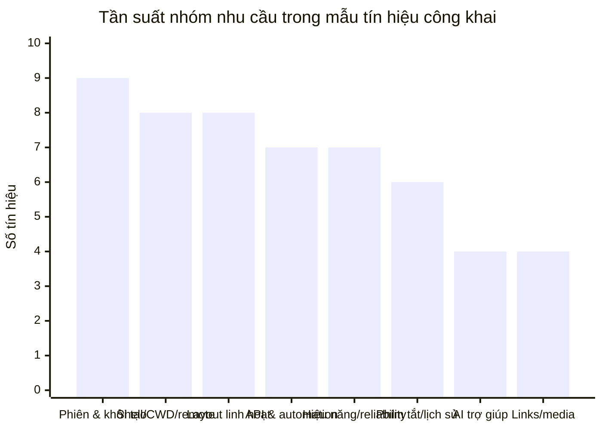

# Nghiên cứu sâu về nhu cầu người dùng đối với terminal extension trong VS Code

## Tóm tắt điều hành

Kết luận lớn nhất từ các tín hiệu xã hội và nhu cầu người dùng công khai là: **cơ hội tốt nhất không nằm ở việc “thay terminal của VS Code bằng một terminal khác”, mà nằm ở việc xây một lớp điều phối workflow xung quanh terminal tích hợp**. Lý do là nhiều extension terminal đời cũ đã bị tính năng lõi của VS Code thay thế một phần hoặc toàn phần: Terminal extension của Jun Han đã tự ghi rõ là chỉ còn cập nhật hạn chế vì VS Code đã có hỗ trợ terminal cơ bản, còn Shell Launcher đã bị tác giả đánh dấu deprecated để nhường chỗ cho built-in terminal profiles. Đồng thời, terminal tích hợp hiện đã có profiles, editor-area terminals, persistent sessions, shell integration, image support và nhiều thiết lập nâng cao ngay trong core product. citeturn47view0turn49view1turn11view1turn11view2turn11view3

Người dùng phát biểu nhu cầu theo bảy cụm rất rõ: **khôi phục phiên và layout theo project**, **đúng shell/cwd/ngữ cảnh local-remote**, **layout linh hoạt hơn** như sidebar/editor/floating window, **API chạy lệnh đáng tin cậy cho extension**, **ergonomics tốt hơn** cho phím tắt/lịch sử/copy-paste, **hiệu năng và độ ổn định**, và gần đây là **AI/command assistance nhưng không muốn rời VS Code**. Các issue GitHub, thảo luận Reddit và câu hỏi Stack Overflow lặp đi lặp lại quanh các chủ đề như restore terminals, split & tabs, pop-out, remote/local shell, promise khi lệnh hoàn tất, keybinding conflicts, terminal chậm, và “muốn có cảm giác Warp nhưng vẫn ở trong VS Code”. citeturn40view3turn8view5turn8view3turn8view0turn40view1turn6view3turn44view1turn6view0

Tình cảm xã hội với terminal tích hợp là **phân cực nhưng có logic nhất quán**. Người thích integrated terminal đánh giá cao việc chạy lệnh sát cạnh code, ít context switching, thuận tiện cho beginners, và hữu ích khi làm remote/SSH. Người không thích thì phàn nàn về chiếm screen real estate, thiếu trải nghiệm nhiều màn hình, xung đột muscle memory của terminal thật, xterm.js “không mượt bằng terminal native”, và mong muốn pop-out/floating window dễ hơn. Điều này gợi ý rằng một extension terminal thành công phải phục vụ **hai mode hành vi**: “quick project commands” và “long-running serious terminal work”. citeturn6view1turn40view0turn40view1turn44view0turn45view0

Từ góc nhìn sản phẩm, danh sách ưu tiên nên là: **project-aware terminal templates + restore**, **shell integration–backed execution state**, **layout linh hoạt nhưng không phá model mặc định của VS Code**, **remote/local clarity**, **keyboard-first UX**, và **trust/security minh bạch**. Các tính năng “hào nhoáng” như AI suggestions, images, agent-aware panes chỉ nên đứng sau khi nền tảng reliability đủ chắc. Đây cũng là khác biệt giữa các extension được dùng thật với các extension chỉ gây ấn tượng trong demo. citeturn21view4turn21view0turn23view0turn32view2turn31view1turn37news0turn37academia12turn37academia13

## Nguồn dữ liệu và cách đọc tín hiệu

Báo cáo này ưu tiên dữ liệu trong ba năm gần đây, nhưng vẫn giữ lại một số thread cũ mang tính “seminal” khi chúng phản ánh nhu cầu gốc vẫn còn sống tới nay, đặc biệt là các chủ đề pop-out terminal, history persistence và hiệu năng render. Các nguồn mạnh nhất trong tập thu thập là GitHub issues của `microsoft/vscode`, trang Marketplace của các extension terminal, Reddit `r/vscode`, Stack Overflow, cùng một số blog/tài liệu chính thức của VS Code và repo extension. citeturn40view2turn40view3turn44view2turn46view0turn11view2

Một quan sát phương pháp rất quan trọng là **tín hiệu Marketplace hữu ích cho install count và value proposition, nhưng thường không đủ để suy diễn sâu về sentiment**. Ví dụ, Terminal có hơn 1,8 triệu installs nhưng chỉ hiện 15 lượt đánh giá; Run Terminal Command có gần 488 nghìn installs nhưng chỉ hiện 9; Restore Terminals hơn 108 nghìn installs nhưng 37 lượt đánh giá; Terminals Manager hơn 74 nghìn installs nhưng 27. Điều này cho thấy Marketplace review/rating là tín hiệu thưa; vì vậy để hiểu pain point thật, GitHub issue, Reddit và Stack Overflow đáng tin hơn nhiều. citeturn47view0turn23view1turn21view4turn23view0

### Ảnh cảm xúc xã hội theo nguồn

| Nguồn | Sắc thái chính | Cách nên đọc |
|---|---|---|
| GitHub issues của VS Code | Thiên về tiêu cực theo bản chất báo lỗi/feature request; rất giàu pain point cụ thể, đặc biệt ở API, layout, persistence, remote và reliability. citeturn8view1turn8view3turn8view5turn8view6turn40view1 | Đây là nguồn tốt nhất để ra backlog sản phẩm. |
| Reddit `r/vscode` | Phân cực: nhóm yêu integrated terminal vì tiện và ít context switch; nhóm ghét nó vì chiếm chỗ, keybinding conflict, multi-monitor và cảm giác không “native”. citeturn6view1turn44view0turn44view1 | Đây là nguồn tốt nhất để hiểu trade-off UX và sentiment. |
| Stack Overflow | Thực dụng, ít cảm xúc hơn; người dùng hỏi rất nhiều về default shell, nhiều terminal, đặt terminal sang cạnh phải, và mô phỏng external-terminal workflows. citeturn7view0turn7view1turn7view2turn45view0 | Đây là nguồn tốt để kiểm định “job to be done” lặp lại. |
| Marketplace | Nghiêng về framing tích cực từ tác giả extension; phù hợp để đọc positioning, feature scope và mức độ adoption. citeturn21view0turn21view4turn23view0turn49view0 | Hữu ích để map cạnh tranh, không đủ để thay GitHub/Reddit. |

## Người dùng thực sự muốn gì

### Bản đồ nhu cầu chính

Biểu đồ dưới đây là mã hóa đa nhãn từ tập tín hiệu công khai đã thu thập. Một thread/issue có thể đóng góp vào nhiều nhóm nhu cầu, nên tổng không cộng thành 100%.

Các cột lớn nhất đến từ cụm issue và thread về restore sessions/layout, remote/local profiles, pop-out và floating, API completion/command-state, lỗi hiệu năng, xung đột keybinding/history, Warp-like AI assistance, cũng như nhu cầu mở link terminal đúng ngữ cảnh hoặc render output phong phú hơn. citeturn40view3turn8view5turn40view1turn8view3turn44view1turn6view3turn6view0turn8view2turn40view4

### Nhu cầu cốt lõi được lặp lại nhiều nhất

**Người dùng muốn terminal “nhớ project của tôi”.** Đây là cụm signal mạnh nhất. Reddit có nhu cầu auto launch/restore một bộ terminal theo workspace; Restore Terminals và Terminals Manager đều được cài rất nhiều vì chúng mở lại server/client/test, autorun commands hoặc tái gắn persistence; VS Code core cũng đã đầu tư persistent sessions nhưng issue và bug cho thấy người dùng vẫn chạm phải cạnh thô khi revive, history navigation và environment không đồng nhất. citeturn6view2turn21view4turn23view0turn11view2turn9search7turn9search18

**Người dùng muốn “đúng shell, đúng cwd, đúng máy”.** Đây là nhu cầu cực thực dụng, đặc biệt với backend, DevOps và người làm remote. VS Code docs nêu rõ profiles là nền tảng cấu hình shell; GitHub issues lại cho thấy khoảng trống ở local terminal khi đang mở remote window, phân biệt task terminal, relative cwd, và shell integration trong các tình huống SSH/sub-shell phức tạp. Nói cách khác, vấn đề không chỉ là “mở terminal”, mà là “mở terminal đúng bối cảnh mà không cần đoán”. citeturn11view1turn8view5turn8view4turn25search0turn11view0

**Người dùng muốn layout linh hoạt hơn, đặc biệt là pop-out/floating và sidebar/editor modes.** Nhu cầu này xuất hiện cả trong issue cũ lẫn mới: từ request pop-out năm 2019 đến nhu cầu “terminal ở màn hình laptop, editor ở màn hình ngoài” năm 2024 và request floating-by-default năm 2025. Stack Overflow còn cho thấy nhu cầu đặt terminal sang cạnh phải đã có từ rất sớm và kéo dài nhiều năm. Social signal ở Reddit cũng xác nhận lý do: screen real estate, multi-monitor, tmux/ssh dài hơi, và mong muốn “chỉ cần pop it out”. citeturn40view2turn40view0turn40view1turn7view2turn6view1

**Người dùng muốn extension API terminal đáng tin hơn cho automation thật sự.** Đây là một tín hiệu rất mạnh nhưng thường bị đánh giá thấp nếu chỉ nhìn end-user review. Nhiều issue yêu cầu callback/promise khi lệnh hoàn tất, khả năng biết active terminal có phải task terminal hay không, khai thác shell integration cho command/output/exit code, hoặc gửi command mà không phải lộ raw input trong terminal. Khi extension author còn phải dùng workaround kiểu “tạo file rồi chờ file xuất hiện”, rõ ràng đây là pain point cấp nền tảng. citeturn8view1turn8view3turn8view4turn39view0turn32view2turn32view3

**Người dùng muốn terminal integrated nhưng không muốn bị “kém hơn terminal thật” về phím tắt, history, typing feel và long-running sessions.** Reddit cho thấy các phàn nàn rất cụ thể: `Ctrl+P` thay vì tới shell lại mở file picker; keybinding kiểu Emacs/shell muscle memory bị VS Code bắt; Alt+Left/Right trong zsh/oh-my-zsh không hoạt động như external terminal; history lâu năm và reverse search là thứ người dùng gắn bó. Điều này cho thấy “ergonomics parity” quan trọng gần ngang với features. citeturn6view1turn6view3turn44view0turn11view2turn14search0

**Người dùng rất nhạy với hiệu năng và các lỗi “nghe có vẻ nhỏ nhưng phá workflow”.** Reddit ghi nhận integrated terminal chậm hơn command prompt/native terminal, bị lag trên Linux, lock up khi output lớn; GitHub issues ghi nhận `sendText` bỏ mất ký tự đầu, relaunch terminal đôi khi chỉ đóng terminal, và historically các vấn đề GPU/render ảnh hưởng nặng tới trải nghiệm. Với terminal, người dùng không chấp nhận “đôi lúc lỗi” vì lỗi nhỏ cũng làm sai lệnh, sai cwd hoặc làm mất niềm tin. citeturn44view1turn44view2turn8view6turn8view7turn11view4

**Một lớp nhu cầu mới là “Warp-like convenience nhưng ở trong VS Code”.** Reddit có người nói thẳng họ thích autocomplete, AI features và typing experience của Warp nhưng khó chịu vì phải quản lý thêm một cửa sổ; Stack Overflow cho thấy câu hỏi “dùng Warp như integrated terminal được không?” có lượng xem cao, và câu trả lời thực dụng nhất lại là mô phỏng bằng global hotkey chứ chưa nhúng thật được. Điều này hé lộ một khoảng trống sản phẩm: người dùng không hẳn cần một terminal emulator mới, mà cần **cảm giác thông minh và mượt hơn trong bối cảnh editor hiện tại**. citeturn6view0turn45view0

### Trích dẫn tiêu biểu từ người dùng

Các trích dẫn dưới đây được **dịch ý sang tiếng Việt** để giữ đúng ngữ cảnh sản phẩm.

| Nguồn | Trích dẫn dịch ý | Hàm ý sản phẩm |
|---|---|---|
| Reddit `r/vscode` | “Tôi thích autocomplete, tính năng AI và cảm giác gõ của Warp, nhưng việc phải mở nó như một cửa sổ riêng thì khá phiền.” citeturn6view0 | Nhu cầu AI/typing enhancement bên trong VS Code, không muốn thêm context switching. |
| Reddit `r/vscode` | “Tôi chỉ muốn có thể pop nó ra thành cửa sổ riêng.” citeturn6view1 | Pop-out/floating không phải nice-to-have, mà là nhu cầu layout thật sự. |
| Reddit `r/vscode` | “Tôi chỉ dùng terminal ngoài, vì tôi cần nhiều connection/tab/tile.” citeturn6view1 | Terminal extension phải cạnh tranh với workflow đa phiên nghiêm túc, không chỉ một panel dưới đáy. |
| GitHub issue của extension author | “Tôi đang phải dùng workaround tạo file rồi đợi file xuất hiện để biết lệnh đã chạy xong; cách này hoạt động nhưng không lý tưởng.” citeturn8view3 | Cần command lifecycle API thật sự, không chỉ `sendText`. |
| GitHub issue của VS Code user | “Tôi muốn tách terminal ra một cửa sổ riêng trên màn hình laptop, còn editor ở màn hình ngoài.” citeturn40view0 | Multi-monitor workflow là phân khúc nhu cầu rõ ràng. |
| GitHub issue của user | “Tôi muốn terminal tabs đặt ở trên hoặc dưới, vì để dọc làm phí chỗ khi panel hẹp và cao.” citeturn8view0 | Layout micro-UX vẫn đáng đầu tư, nhất là với người dùng màn hình rộng hoặc side panel. |

### Nhu cầu theo nhóm người dùng

| Nhóm người dùng | Nhu cầu nổi bật | Hệ quả cho extension |
|---|---|---|
| **Người mới học** | Muốn chạy lệnh ngay cạnh code, dùng ít cấu hình, đỡ lạc vào quá nhiều popup/cơ chế run-debug; integrated terminal là “all I need” nếu mở/hide nhanh và chạy code được. citeturn6view1turn10search14 | Mặc định phải dễ dùng ngay, có quick actions rõ ràng, không ép học JSON sớm. |
| **Web dev** | Muốn mở nhiều terminal theo project kiểu `server/client/test/watch`, autorun theo workspace, restore lại nguyên layout khi mở dự án. citeturn21view4turn23view0 | Phải có project templates, named terminals, save/restore sẵn cho repo. |
| **Backend dev** | Quan tâm shell/profile đúng, cwd đúng, nhiều split, có thể kết hợp local và remote, muốn link/file handling tốt và status lệnh rõ ràng. citeturn8view5turn8view2turn11view1turn11view3 | Phải coi local/remote/context như tính năng lõi, không phải edge case. |
| **DevOps/SRE** | Dùng nhiều connection, tmux/ssh, long-running tasks, multi-monitor, notification khi job/agent xong, session persistence là bắt buộc. citeturn6view1turn24search7turn49view0turn21view1 | Phải có persistent workspace, finish notification, remote badges, và support multiplexer tốt. |

## So sánh cạnh tranh của các extension terminal

Điểm cần nhấn mạnh trước khi so sánh là: **đối thủ lớn nhất của một terminal extension mới chính là terminal tích hợp của VS Code**. Terminal core nay đã có profiles, panel/editor locations, split groups, shell integration, persistent sessions, image support, link handling, keyboard routing và cả hỗ trợ Copilot trong terminal. Rất nhiều extension nổi tiếng thực chất đang lấp **khoảng trống workflow** chứ không thay thế terminal engine. citeturn11view1turn11view2turn11view3

### Bảng so sánh sáu extension tiêu biểu

Bảng dưới đây dùng **installs và số lượt đánh giá hiển thị trên Marketplace** làm tín hiệu định lượng chính, vì đây là dữ liệu có thể truy xuất ổn định trong tập nguồn đã thu thập.

| Extension | Tín hiệu Marketplace | Năng lực chính | Khi nào người dùng chọn | Phàn nàn hoặc giới hạn nổi bật |
|---|---|---|---|---|
| **Terminal** | 1,819,025 installs; 15 lượt đánh giá. citeturn47view0 | Chạy lệnh ngay từ text editor, mở terminal ở thư mục file hiện tại, toggle terminal qua status bar. citeturn47view0 | Hợp với workflow “run selected command fast”, nhất là thời kỳ đầu VS Code. | Tác giả nói rõ extension chỉ còn cập nhật hạn chế vì Code Runner và built-in terminal đã thay thế nhiều use case; issue list cho thấy bug mở sai folder, high CPU, performance exhaustion, font/display và command not found. citeturn47view0turn47view1 |
| **Run Terminal Command** | 487,889 installs; 9 lượt đánh giá. citeturn23view1 | Chạy các lệnh định nghĩa sẵn từ Explorer/context menu/Command Palette; có group, preserve terminal, biến `{resource}` và `{clipboard}`. citeturn23view1 | Phù hợp khi nhu cầu là “command launcher”, không phải terminal manager. | Phạm vi hẹp: không giải bài toán session restore, layout, remote/local context hay command lifecycle state; về bản chất là shortcut layer hơn là terminal UX layer. Đây là giới hạn tính năng nhìn thấy ngay từ trang extension. citeturn23view1 |
| **Terminal Keeper** | 222,388 installs; 13 lượt đánh giá. citeturn21view0 | Restore last session, session selection/removal, themes, import commands từ package managers/build tools. citeturn21view0 | Hợp với người cần “project memory” và ít muốn tự viết JSON phức tạp. | Tác giả thừa nhận đang bị giới hạn bởi VS Code API nên chưa lấy được icon/color/last command; issue cho thấy pain point về relative `cwd` và lỗi reload sau VS Code 1.98 khiến một nửa terminal fail. citeturn21view0turn25search0turn24search11 |
| **Restore Terminals** | 108,383 installs; 37 lượt đánh giá. citeturn21view4 | Tự động spawn terminal, split terminal, chạy command khi VS Code start; hỗ trợ `.vscode/restore-terminals.json`. citeturn21view4 | Rất hợp với web dev hoặc full-stack có layout server/client/test cố định. | Tài liệu khuyên tăng `artificialDelayMilliseconds` nếu bị “glitching out”, cho thấy độ ổn định startup có thể mong manh; mặc định còn có logic đóng terminal đang mở nếu không cấu hình giữ lại. citeturn21view4 |
| **Terminals Manager** | 74,203 installs; 27 lượt đánh giá. citeturn23view0 | JSONC config mạnh, autorun/autokill, tmux/screen persistence, split, recycle, dynamic title, env/cwd/shell tùy biến sâu. citeturn23view0 | Hợp với power user thích cấu hình rõ ràng và workflow kiểu terminal orchestration. | Độ phức tạp cao hơn hẳn; persistence của extension có thể xung đột với persistence native của VS Code nên chính tác giả khuyên vô hiệu hóa revive process ở core. citeturn23view0 |
| **Windows Terminal Integration** | 69,549 installs; 8 lượt đánh giá. citeturn49view0 | Mở Windows Terminal từ Explorer/context menu; hỗ trợ WSL remote, SSH remote, dev containers; có thể chuyển Explorer “Open in Terminal” sang external. citeturn49view0 | Hợp với người thực ra **không muốn** integrated terminal, nhưng muốn workflow gắn chặt giữa VS Code và terminal ngoài. | Chỉ giải external-terminal integration, phụ thuộc Windows Terminal và Windows; nó xác nhận một phân khúc rất rõ: người dùng muốn interoperability hơn là nhốt mọi thứ vào panel của VS Code. citeturn49view0 |

### Xu hướng mới nổi mà bảng top installs chưa phản ánh hết

Trong giai đoạn 2025–2026, hướng đổi mới không nằm ở “thêm một launcher lệnh nữa”, mà nằm ở **terminal như một surface mới trong VS Code**. Secondary Terminal đẩy terminal vào sidebar, có AI agent awareness, split views, session persistence và tuyên bố không thu thập terminal content; Mira Terminal đưa terminal thành editor tab với PTY thật và tab restore; Agent Grid thì dùng `tmux` để biến một terminal tab thành workspace nhiều lane cho Claude Code/Codex/Gemini CLI/Aider. Đây là tín hiệu rõ ràng rằng nhu cầu đang dịch chuyển từ “chạy lệnh” sang “điều phối workflow terminal-native phức tạp ngay trong IDE”. citeturn21view2turn21view3turn21view1

### Hàm ý cạnh tranh

Nếu làm extension mới, bạn không nên cạnh tranh trực diện với built-in terminal ở lớp emulation/rendering, trừ khi có lý do cực mạnh. Ngay cả Stack Overflow về việc nhúng Warp vào integrated terminal cũng cho thấy người dùng muốn điều đó, nhưng cộng đồng và backlog đều thừa nhận nó cực khó về engineering; workaround thực tế hiện nay vẫn là hotkey/global window, chứ chưa phải thay engine trong VS Code. Vì vậy, chiến lược khôn ngoan là **built-in-first, workflow-first**: dùng terminal gốc của VS Code làm nền, sau đó thắng bằng orchestration, persistence, command-state và UX context. citeturn45view0turn32view2

## Đề xuất sản phẩm, UX và kỹ thuật

### Danh sách tính năng ưu tiên

| Mức ưu tiên | Tính năng | Vì sao nên ưu tiên |
|---|---|---|
| **Must-have** | **Project-aware templates và restore** cho terminal names, splits, cwd, commands, icon/color, startup behavior | Đây là nhu cầu được lặp lại nhiều nhất ở Reddit, GitHub và marketplace của Restore Terminals / Terminal Keeper / Terminals Manager. Người dùng nhớ project và muốn “mở repo là làm việc tiếp”. citeturn6view2turn21view4turn21view0turn23view0turn40view3 |
| **Must-have** | **Shell/CWD/remote correctness** với local/remote badges, default profile rõ ràng, relative cwd tử tế | Sai shell hoặc sai cwd làm người dùng mất niềm tin ngay; pain point này xuất hiện ở profiles docs, remote/local issue và issue relative cwd của Terminal Keeper. citeturn11view1turn8view5turn25search0 |
| **Must-have** | **Execution state đáng tin cậy**: start/running/success/fail, exit code, command history, fallback khi thiếu shell integration | Extension authors đang thiếu callback/promise chắc chắn, và người dùng cuối cần biết lệnh đã xong hay chưa, nhất là với long-running tasks. citeturn8view1turn8view3turn32view2turn32view3turn24search7 |
| **Must-have** | **Layout linh hoạt nhưng nhẹ**: panel, editor, sidebar; detach/floating flow tốt; split templates | Pop-out/floating xuất hiện liên tục trong nhiều năm; side/editor surfaces là xu hướng mới nổi. citeturn40view2turn40view1turn40view0turn21view2turn21view3 |
| **Must-have** | **Keyboard-first UX** với pass-through phím, discoverability tốt, quick toggles | Pain point về Ctrl+P, Alt+Left/Right, emacs/shell muscle memory là cực thực và tác động trực tiếp tới adoption. citeturn6view1turn6view3turn11view2 |
| **Must-have** | **Khung trust/security minh bạch**: không thu thập terminal content mặc định, hạn chế permissions, tôn trọng Workspace Trust và telemetry settings | Người dùng đã nói thẳng họ ngại cài thêm extension vì rủi ro bảo mật, và các nghiên cứu/incident gần đây cho thấy mối lo này là có cơ sở. citeturn6view2turn31view1turn37news0turn37news2turn37academia12turn37academia13 |
| **Nice-to-have** | **Inline command intelligence** kiểu autocomplete/explain/suggest, nhưng opt-in và không lấn át command line gốc | Có nhu cầu rõ ràng từ người thích Warp-like behavior, nhưng sentiment nói chung chưa cho thấy đây là thứ nên đặt lên trên reliability. citeturn6view0turn45view0 |
| **Nice-to-have** | **Finish notifications** cho long-running command/agent/task | Phù hợp mạnh với DevOps, AI-agent workflows, build/test dài hơi. citeturn24search7turn21view1turn21view2 |
| **Nice-to-have** | **Link routing và rich output**: mở `file://` trong browser khi cần, image support, logs/HTML preview | Có issue cụ thể về mở file links bằng browser; image support đã có trong core nhưng còn hạn chế. citeturn8view2turn12view3 |
| **Optional** | **tmux-backed or agent-grid mode** cho team/power users | Đây là hướng tăng trưởng tốt nhưng không nên là MVP, vì nó đẩy complexity và phụ thuộc môi trường ngay lập tức. citeturn21view1turn23view0 |
| **Optional** | **Team-shared repo config** để onboarding đồng bộ terminal layout | Có giá trị cho team workflows, nhưng nên đến sau khi local single-user flow thật chắc. citeturn21view1turn21view4 |

### UX flow khuyến nghị

#### Mở nhanh theo ngữ cảnh hiện tại

Người dùng đang mở file hoặc folder, bấm một shortcut duy nhất, extension hiện một quick pick rất ngắn: **Open Here**, **Run Saved Command**, **Open Workspace Layout**, **Open External**. Nếu repo đã có template, lựa chọn mặc định phải là template đó; nếu không, mở terminal ở đúng `fileDirname` hoặc workspace folder. Lối đi này trả lời trực tiếp nhu cầu “nhanh, đúng chỗ, không cần nghĩ”. citeturn11view3turn19search10turn47view0

#### Khôi phục workspace phát triển

Khi mở một project, extension phát hiện cấu hình `.vscode/...` và hiển thị preview tối giản: tên terminal, split layout, startup commands, local/remote scope. Người dùng chỉ cần nhấn **Restore** hoặc **Don’t auto-run commands**. Flow này nên học từ Restore Terminals và Terminals Manager, nhưng giảm ma sát bằng UI preview thay vì bắt người dùng đọc JSON trước. citeturn21view4turn23view0

#### Chạy lệnh có trạng thái

Khi người dùng chạy một saved command hoặc extension tự chạy command, terminal nên hiển thị rõ ba lớp: **đang chạy**, **chạy xong với exit code**, **hành động tiếp theo** như “mở browser”, “focus terminal”, “show logs”, “rerun”. Nếu shell integration có sẵn thì đọc lifecycle chuẩn; nếu không có, fallback an toàn chứ không giả vờ biết trạng thái. Đây là khác biệt then chốt giữa automation “đủ dùng” và automation “đáng tin”. citeturn32view2turn32view3turn8view3turn8view1

#### Chế độ remote lai local

Trong remote windows, người dùng phải nhìn thấy mình đang mở **terminal ở đâu**: local host, SSH remote, dev container hay WSL. Nếu extension có cả local và remote terminals, mỗi terminal nên có badge scope và behavior nhất quán. Đây là pain point rất thực, đặc biệt khi user mong “create new local terminal” nhưng lại thấy một hành vi mơ hồ hoặc khác nhau theo từng remote type. citeturn8view5turn49view0turn31view2

### Cân nhắc kỹ thuật

#### Chọn API nào để xây

Nền tảng nên dựa trước hết vào terminal gốc của VS Code: `createTerminal(TerminalOptions)` cho shell process thường, `createTerminal(ExtensionTerminalOptions)` hoặc `Pseudoterminal` chỉ dùng khi thật sự cần surface tùy biến; `registerTerminalProfileProvider` cho profiles có trong UI; `EnvironmentVariableCollection` để sửa môi trường theo scope; `location` để hỗ trợ panel/editor; `hideFromUser` cho non-intrusive background setup; `isTransient` để kiểm soát persistence. Các API shell integration mới cho phép nghe `onDidStartTerminalShellExecution`, `onDidEndTerminalShellExecution` và dùng `executeCommand`, giúp bỏ bớt trò `sendText` mù mờ. citeturn32view1turn32view2turn32view3turn32view4turn33view0turn33view2turn33view4turn33view5

#### Hạn chế kỹ thuật cần chấp nhận sớm

Shell integration không phải lúc nào cũng bật sẵn hoặc hoạt động a priori trong mọi tình huống; tài liệu chính thức nói rõ automatic injection có thể không chạy đúng trong sub-shell, SSH thường hoặc shell setup phức tạp, và khi đó phải có manual installation. Nói đơn giản hơn: **đừng thiết kế sản phẩm dựa trên giả định shell integration luôn hiện diện**, và luôn cần fallback UX rõ ràng. citeturn11view0turn32view2

Nếu muốn làm sidebar/editor-tab terminal “đẹp hơn”, hãy nhớ đây là vùng rủi ro hiệu năng. VS Code core đã có GPU/webgl/canvas tuning và image support nhưng vẫn còn giới hạn; cộng đồng đã nhiều lần báo lag với output lớn, lock up, GPU blacklist hoặc shell integration bugs. Vì vậy, nếu không buộc phải render PTY riêng, nên ưu tiên built-in terminal surface hơn webview terminal. Nếu buộc phải làm custom renderer, phải benchmark với output nặng, clipboard, IME, resize, Unicode, remote và restore. citeturn11view2turn12view3turn44view1turn44view2turn21view2turn21view3

#### Quyền hạn, trust và bảo mật

Một terminal extension dễ chạm vào những thứ nhạy cảm nhất của người dùng: command history, secrets trong output, SSH workflows, credential prompts và cross-extension data paths. VS Code cung cấp khuôn `untrustedWorkspaces` để tuyên bố extension hỗ trợ Restricted Mode hoàn toàn, không hỗ trợ, hoặc hỗ trợ một phần; với loại extension này, thiết kế an toàn hợp lý nhất thường là **`limited`**: cho phép UI tĩnh nhưng khóa các tính năng tự chạy command/script cho tới khi workspace được tin cậy. citeturn31view1turn31view4

Khía cạnh này không chỉ là “theory”. Trong cuối tháng 5 năm 2026 đã có các bản tin về việc GitHub bị compromise thông qua một VS Code extension độc hại trên máy nhân viên; đồng thời các nghiên cứu gần đây về toàn bộ hệ sinh thái extension cho thấy tỷ lệ hành vi đáng ngờ và nguy cơ data exposure không nhỏ. Trong ngữ cảnh đó, một terminal extension muốn được cài phải **ít quyền nhất có thể, minh bạch về telemetry, và tuyệt đối không coi terminal content là dữ liệu sản phẩm mặc định**. citeturn37news0turn37news2turn37academia12turn37academia13turn47view0turn21view2

#### Chi tiết UX-level nhưng quan trọng

Nếu dùng status bar, hãy dùng rất tiết chế. VS Code khuyến nghị status bar items nên ngắn, icon dùng ít, và không spam nhiều item vì khu vực này cạnh tranh với vô số extension khác. Với terminal extension, một status item duy nhất cho “workspace layout active / command running” là hợp lý hơn nhiều so với nhiều nút màu mè. citeturn31view3

## Lộ trình đề xuất và nguồn ưu tiên

### Roadmap gợi ý

| Giai đoạn | Phạm vi | Mục tiêu sản phẩm |
|---|---|---|
| **MVP** | Workspace templates; named terminals; split restore; cwd/profile correctness; quick open here; one discreet status item; không thu thập terminal content mặc định; Restricted Mode rõ ràng | Chứng minh giá trị cốt lõi: “mở project là làm việc tiếp được ngay, đúng shell, đúng chỗ”. citeturn21view4turn21view0turn23view0turn31view1 |
| **Bản phát hành tiếp theo** | Shell-integration powered command state; finish notification; rerun/open-browser rules; safe fallbacks khi không có shell integration | Nâng extension từ launcher thành orchestration layer đáng tin. citeturn32view2turn32view3turn8view2turn24search7 |
| **Bản phát hành sau đó** | Editor/sidebar layouts; detachable flows tốt hơn; pin/focus rules; terminal groups templates; keyboard ergonomics presets | Giải quyết phân khúc power user và multi-monitor mà không phá sự đơn giản của MVP. citeturn40view1turn40view0turn6view1turn21view2turn21view3 |
| **Bản trưởng thành** | Repo-shared configs; task terminal awareness; remote/local hybrid presets; optional AI command assistance; optional tmux/agent workspace mode | Mở sang team workflows và AI-native terminal usage sau khi reliability đủ chắc. citeturn8view4turn8view5turn21view1turn6view0 |

### GitHub issues và threads nên đọc kỹ

| Mục | Vì sao đáng đọc |
|---|---|
| **Expose shell integration command knowledge to extensions** citeturn8view1 | Nền tảng cho command lifecycle, exit code, output-aware workflows. |
| **Callback or Promise for Terminal Command Completion** citeturn8view3 | Pain point trực tiếp của extension authors. |
| **Support configuring the local terminal launched in remote windows** citeturn8view5 | Rất quan trọng cho hybrid local/remote UX. |
| **Opening terminal in a new window** và **Detach as floating window by default** citeturn40view0turn40view1 | Tóm tắt nhu cầu multi-monitor/pop-out cực rõ. |
| **Restore terminal sessions between restarts** citeturn40view3 | Seminal issue cho persistence. |
| **integrated terminal tabs on the top or bottom** citeturn8view0 | Ví dụ điển hình của micro-layout pain point nhưng tác động lớn. |
| **Can you get Warp terminal as the integrated terminal in VS Code?** citeturn45view0 | Cửa sổ nhìn rất tốt vào nhu cầu “Warp-like inside VS Code”. |
| **Does almost everyone prefer the integrated terminal over an external terminal?** citeturn6view1 | Thread xã hội quan trọng nhất để hiểu sentiment phân cực. |

### Các trang Marketplace nên dùng làm nguồn cạnh tranh

| Extension page | Tại sao nên lưu |
|---|---|
| **Terminal** citeturn47view0 | Trường hợp kinh điển của extension bị core product vượt qua. |
| **Restore Terminals** citeturn21view4 | Chuẩn so sánh cho workspace-restore workflow. |
| **Terminal Keeper** citeturn21view0 | Ví dụ hiện đại hơn của session-centric value prop. |
| **Terminals Manager** citeturn23view0 | Chuẩn so sánh cho power-user orchestration. |
| **Windows Terminal Integration** citeturn49view0 | Nguồn tốt để hiểu phân khúc thích external terminal. |
| **Secondary Terminal** citeturn21view2 | Tín hiệu về xu hướng AI-aware sidebar terminals. |

### Câu trả lời sản phẩm ngắn gọn

Nếu phải rút toàn bộ nghiên cứu này thành một câu, thì câu đó là:

**Người dùng không thiếu cách mở terminal; họ thiếu một terminal extension biết nhớ dự án, hiểu ngữ cảnh, chạy lệnh đáng tin, tôn trọng keyboard/space của họ, và không làm họ lo về hiệu năng hay bảo mật.** citeturn6view2turn8view5turn8view3turn6view1turn44view1turn37academia12

### Câu hỏi mở và giới hạn

Phần dữ liệu mạnh nhất trong báo cáo đến từ GitHub, Reddit, Stack Overflow và Marketplace pages. Phần review text chi tiết của Marketplace, cũng như YouTube comments và X posts/comments, không truy xuất được nhất quán trong tập nguồn công khai đã thu thập, nên chúng chỉ được dùng như tín hiệu phụ chứ không phải trụ cột kết luận. Ngoài ra, các con số “lượt đánh giá” trên Marketplace là rất thưa so với install count, nên không nên dùng chúng như proxy duy nhất cho user satisfaction.