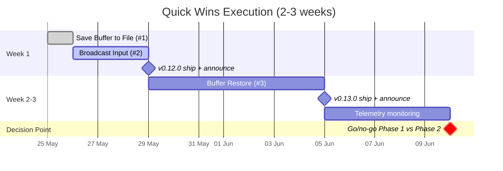

# AnyWhere Terminal — Quick Wins Execution Plan

> **Status:** Tactical execution extract — derived from `PLAN.md` (v0.11.4) and evaluation session 2026-05-24.
>
> **Scope:** 3 lowest-effort tasks ranked by `value / effort` ROI. Designed to ship momentum in 2-3 weeks before committing to longer-horizon Phase 1 (cross-platform) or Phase 2 (workspace templates).
>
> **Purpose:** Front-load value delivery, back-load risk. Build marketplace momentum and credibility while collecting telemetry to inform Phase 1+ commitments.

---

## Why Quick Wins First

**Strategic reasoning:** PLAN.md commits 5-7 weeks to Phase 1 (Windows + Linux + persistence). This is high-risk if:

- Windows realistic effort is **2x the estimate** *[Engineering reasoning — node-pty Windows complexity: ConPTY, WinPTY fallback, shell matrix]*
- No marketplace signal yet to justify the investment
- Solo dev burn-out risk on multi-week pure-infrastructure work

**Quick-wins-first strategy:**

1. Ship 3 visible features in 2-3 weeks → marketplace activity, install velocity signal
2. Collect telemetry: are users adopting? Where are reviews critical?
3. **Then** decide: push Phase 2 (workspace templates) or invest Phase 1 cross-platform?

This trades **2-3 weeks of cross-platform delay** for **information-rich decision-making** before the next 5-7 week commitment.

---

## #1 — Save Buffer to File

**ROI:** Highest in entire plan (`value / effort`)

### Specs

| Item | Value |
|---|---|
| Effort | **~100 LOC, 1 day** *[Verified — PLAN.md §5.4]* |
| Risk | Cực thấp — no platform-specific concerns, no UI complexity |
| Dependency | `OutputBuffer.ts` already exists in current codebase |
| User pain solved | "I need to save this terminal output to share/archive" |

### Implementation

| Item | Notes |
|---|---|
| Command | `AnyWhere Terminal: Save Buffer to File...` |
| Dialog | Use `vscode.window.showSaveDialog()` |
| Scope | Full scrollback (not just visible viewport) |
| Format options | (a) Plain text (default), (b) ANSI-stripped, (c) With-ANSI for replay in compatible viewers |
| Filename default | `<terminal-name>-<timestamp>.txt` |
| Error handling | If buffer is empty or write fails, show informative error toast |

### Demand signal

`aosho235.vscode-save-terminal-buffer` exists as standalone extension — proven niche demand. AT can absorb this niche by bundling it natively. *[Verified — PLAN.md §5.4 reference]*

### Risk assessment

| Risk | Likelihood | Mitigation |
|---|---|---|
| ANSI stripping edge cases | Low | Use battle-tested `strip-ansi` npm package |
| Large buffer memory issue | Very Low | Stream write if buffer > 10MB |
| Cross-platform path handling | None — VS Code save dialog handles this |

### Microsoft absorption risk: **Low**

VS Code core has no built-in "save terminal buffer" command despite years of demand. Not a priority for them. *[Engineering reasoning]*

### Reference

- Extension: `aosho235.vscode-save-terminal-buffer`
- PLAN.md §5.4

---

## #2 — Broadcast Input to Panes

**ROI:** Second highest — small effort, niche-but-vocal user segment

### Specs

| Item | Value |
|---|---|
| Effort | **~200 LOC, 2-3 days** *[Verified — PLAN.md §5.5]* |
| Risk | Thấp — extends existing infrastructure |
| Dependency | AT's split tree already fans events — only need event multiplexer |
| User pain solved | "I need to type the same command across multiple SSH sessions / panes" |

### Implementation

| Item | Notes |
|---|---|
| Command | `AnyWhere Terminal: Broadcast Input to Group` (toggle) |
| Scope | Per split-group (matches iTerm2 mental model), NOT per-tab |
| UI indicators | (a) Status bar entry while active, (b) Pane border tint (e.g. accent color border on broadcasting panes) |
| Keybinding | None default — power users will assign their own |
| Safety | Show one-time warning toast on first activation: *"Broadcast mode: every keystroke goes to ALL panes in this group. Press Cmd+Shift+B to toggle off."* |

### Demand signal

| Segment | Why they want this |
|---|---|
| DevOps/SRE | Apply same command to multiple SSH sessions (deploy, log tail, status check) |
| Backend dev | Run same test command in multiple Docker container shells |
| Sysadmin | Configuration sync across servers |

User quote (translated, from custom-gpt.md DevOps/SRE persona): *"DevOps/SRE: Dùng nhiều connection, tmux/ssh, long-running tasks, multi-monitor."* *[Verified — custom-gpt.md user segment analysis]*

This is **niche but vocal** — the segment is small but the use case is unique enough that broadcast input becomes a sticky feature.

### Risk assessment

| Risk | Likelihood | Mitigation |
|---|---|---|
| Accidental broadcast to wrong group | Medium | Visual indicators (border tint + status bar) + warning toast on first use |
| Performance with many panes | Low | Event fanout is O(n) where n = panes in group; typical max ~6 |
| Inconsistent line endings across shells | Low | Send raw keystrokes, let each shell handle terminators |

### Microsoft absorption risk: **Low**

VS Code core has no broadcast feature. Tabby and iTerm2 have it. Microsoft unlikely to prioritize this in 2026. *[Engineering reasoning]*

### Reference

- iTerm2 / Tabby "Broadcast Input" feature parity
- PLAN.md §5.5

---

## #3 — Buffer Restore Visual-Only

**ROI:** Sweet spot — moderate effort + highest user demand of any feature in the plan

### Specs

| Item | Value |
|---|---|
| Effort | **300-500 LOC, ~1 week** *[Verified — PLAN.md §5.3]* |
| Risk | Medium — honest framing critical |
| Dependency | `OutputBuffer.ts` + `workspaceState` infrastructure already used for tab names |
| User pain solved | Partial — "my scrollback survives reload" (process revive NOT solved) |

### Why this is the "sweet spot"

Of the three quick wins, this is the **only one that overlaps with the top-3 user demands** (see `PLAN-top-user-want.md` #1). The other two quick wins are nice-to-have polish; this one moves the needle on the canonical persistence issue (`microsoft/vscode #44302`, open since 2018).

**The trade-off:** Honest framing is mandatory. Users want process revive (bpasero: *"reconnect to a running 'npm run watch'"*); buffer restore is a consolation prize. Overselling will damage trust.

### Implementation

#### Snapshot strategy

| Item | Notes |
|---|---|
| Capture target | Last N lines of scrollback (cap ~500KB per terminal) + cursor position + cwd |
| Storage | `workspaceState` (already used for tab names) |
| **Trigger (revised from PLAN.md)** | `onWillDispose` + every 30s if dirty + on cwd change. **NOT** 5s polling — wasteful for idle and expensive for heavy-output terminals. *[Engineering reasoning correction]* |
| Eviction | Snapshots older than 24h dropped; per-workspace cap 10MB total |

#### Restore strategy

| Item | Notes |
|---|---|
| Trigger | On webview init, check `workspaceState` for snapshot matching this terminal slot |
| Paint order | Paint snapshot as historical content **before** new PTY's first byte |
| Visual marker | Single dim divider line: `─── reattached ───` |
| User signal | First-use notification (dismissible): *"Scrollback restored from previous session. Note: running processes are not revived."* |

#### Honest framing (mandatory)

All user-facing copy must explicitly state this is **buffer restore, not process revive**:

| Surface | Required copy |
|---|---|
| README | *"Your scrollback survives Ctrl+R and window reload. Your running processes do not."* |
| Command palette | `AnyWhere Terminal: ... (buffer only)` |
| First-use notification | *"Scrollback restored. Running processes are not revived."* |
| Settings description | Honest explanation of scope |

### Risk assessment

| Risk | Likelihood | Mitigation |
|---|---|---|
| User expects process revive, complaints | **High** | Mandatory honest framing across all surfaces |
| Snapshot serialization perf hit | Medium | Event-driven (not polling), incremental delta, cap 500KB |
| `workspaceState` size limits | Low | 10MB cap with eviction |
| Restore paint flicker | Medium | Paint before first PTY byte; test with rapid reload |

### Microsoft absorption risk: **Medium-High**

VS Code core already has persistent sessions. Buffer restore is the natural next step. *[Engineering reasoning]*

**Mitigation:** Ship within next 1-2 monthly releases. Document the feature publicly (blog post, marketplace listing) to establish AT's claim on this niche before MS ships.

### Reference

- Issue cluster: `microsoft/vscode #44302`, `#128001`, `#131634`
- PLAN.md §5.3

---

## Recommended Execution Timeline

| Week | Deliverable | Outcome |
|---|---|---|
| **Week 1** | v0.12.0: Save Buffer (1d) + Broadcast Input (3d) | 2 features ship, marketplace activity, credibility built |
| **Week 2-3** | v0.13.0: Buffer Restore Visual-Only (~1w) + telemetry monitor (3-5d) | High-demand feature lands, install velocity signal collected |
| **Decision point** | Go/no-go on Phase 1 (cross-platform) vs Phase 2 (workspace templates) | Data-informed next commitment |

---

## Validation Criteria (telemetry-informed)

**Define success metrics BEFORE shipping**, not retrospectively:

| Metric | 30-day target | Action if missed |
|---|---|---|
| Install velocity (cumulative new installs) | +5,000 | <500 → rethink positioning, consider Cursor-first pivot |
| 7-day retention | >40% | <25% → audit which feature drives uninstall (review comments) |
| Marketplace review velocity | +5 reviews/month | <2 → low organic discovery, consider blog post / Twitter outreach |
| GitHub issue volume | +10 issues (any type) | Zero issues → users not engaged enough to file bugs, concerning |
| Quick win adoption | >30% of active users trigger at least one quick-win command | <10% → features are invisible, fix discoverability |

**Tracking implementation:** AT's Phase 0 trust posture prohibits content collection. Use **command invocation count only** (no arguments, no outputs). Opt-in via standard VS Code telemetry setting.

---

## Why This Sequence Beats "Phase 1 First"

| Approach | Time to first ship | Risk profile | Information collected |
|---|---|---|---|
| Phase 1 first (per PLAN.md) | 5-7 weeks | Single big bet on cross-platform + persistence | Minimal until ship |
| **Quick wins first** | 1 week to v0.12.0 | 3 small bets, each independently valuable | Rich telemetry by week 3 |

**Phase 1 risk that quick-wins-first mitigates:**

- Windows effort variance (PLAN.md estimate 2-3w; realistic 4-6w) *[Engineering reasoning]*
- No early signal on whether AT's positioning resonates
- 5-7 weeks of zero marketplace activity hurts ranking and discoverability

**Quick-wins-first risk:**

- Delays Windows users by 2-3 weeks (acceptable — they're 0% of users today)
- Could fragment commits to old codebase if Phase 1 refactors heavily (low — quick wins touch isolated surfaces)

---

## Open Questions

1. **Telemetry consent.** AT's Phase 0 forbids content collection. Is **command invocation count only** acceptable? Or should AT operate completely blind? If blind, validation criteria must rely on GitHub issues + marketplace reviews only (slower signal).

2. **Cursor / Windsurf compat testing.** Each quick win should be smoke-tested on Cursor (>=3.2.21 per PLAN.md §1) and Windsurf. Does AT have CI for this? If not, the test matrix grows linearly per feature.

3. **Marketplace SEO.** Quick wins should be reflected in marketplace description for discovery. Who owns the listing copy? When to update?

---

## Caveats

- **Effort estimates inherited from PLAN.md** *[Verified]* but solo-dev velocity varies. Pad by 30% if context-switching cost is high.
- **Microsoft absorption risk estimates are engineering judgment** *[Engineering reasoning]*, not quantitative. Monitor VS Code release notes monthly during this window.
- **Validation thresholds (5k installs, 40% retention)** are reasoned defaults *[Engineering reasoning]*, not derived from comparable extension benchmarks in this session. Adjust based on AT's current baseline once available.
- **Decision point at week 3** assumes 30 days of telemetry. If signal is unclear, extend monitoring window before committing to Phase 1 vs Phase 2.

---

## Cross-references

- High-demand strategic features: `PLAN-top-user-want.md`
- Full strategic context: `PLAN.md`
- Source research: `docs/external-research/custom-claude.md`, `docs/external-research/custom-gpt.md`